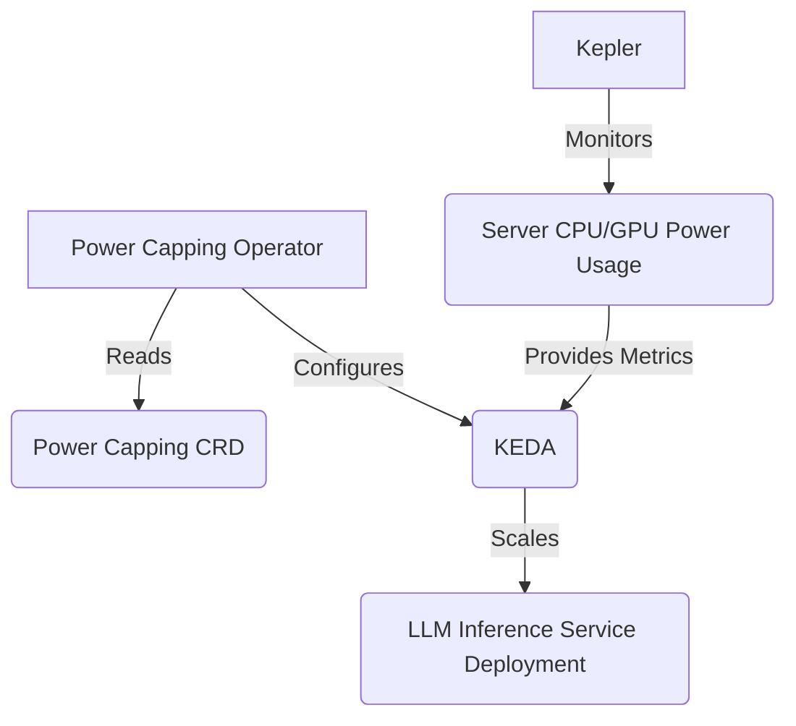
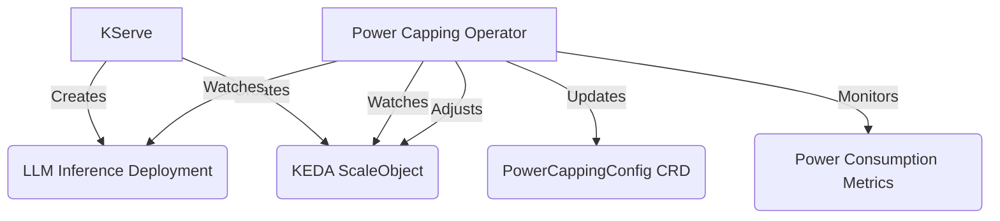
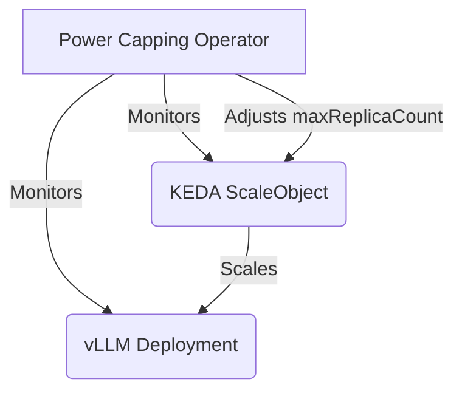
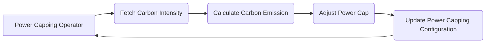
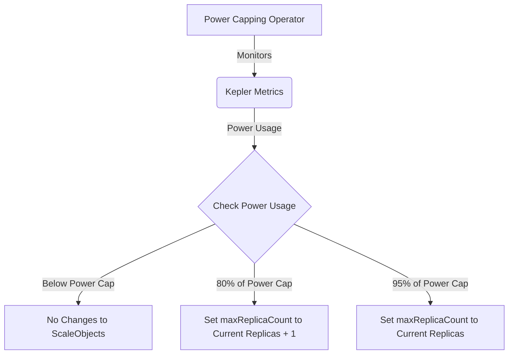
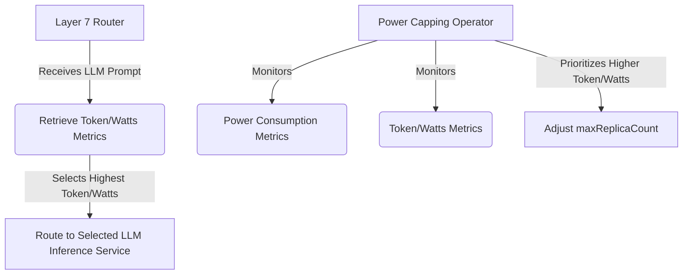
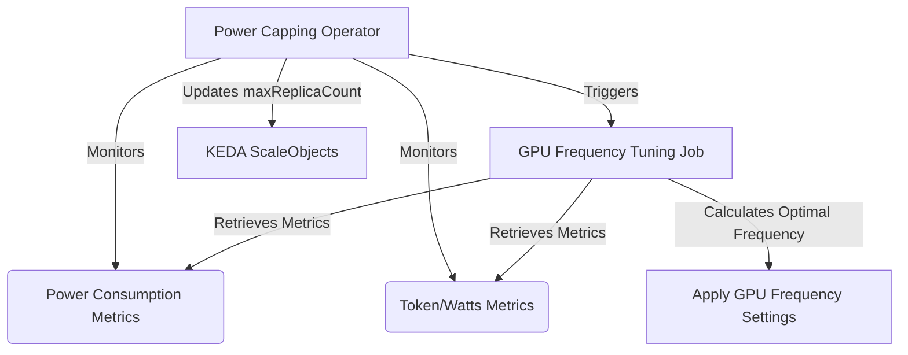
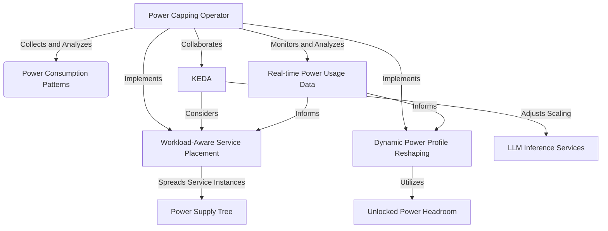

# Power-Capped LLM Inference Service using Kubernetes

## 1. Overview

The purpose of this project is to create a scalable and power-efficient LLM (Large Language Model) inference service
using Kubernetes. The service will utilize a custom power capping operator that accepts a Custom Resource Definition (
CRD) to specify the power capping limit. The operator will use KEDA (Kubernetes Event-Driven Autoscaling) to scale the
LLM inference service deployment based on the specified power cap. [Kepler](https://github.com/sustainable-computing-io/kepler), a power monitoring tool, will be used to
monitor the power consumption of CPU and GPU resources on the server.

Please see [BENEFITS](doc/designs/BENEFITS.md) for a detailed description of the motivations of this project.

## 2. Architecture

### 2.1 Components

- Power Capping Operator: A custom Kubernetes operator that manages the power capping functionality of the LLM inference
  service.
- Custom Resource Definition (CRD): Defines the power capping limit and other configuration parameters for the LLM
  inference service.
- [KEDA](https://github.com/kedacore/keda): Kubernetes Event-Driven Autoscaling tool that scales the LLM inference service deployment based on the power
  consumption metrics.
- LLM Inference Service: A Kubernetes deployment that runs the LLM inference workload.
- [Kepler](https://github.com/sustainable-computing-io/kepler): A power monitoring tool that measures the power consumption of CPU and GPU resources on the server.

### 2.2 Flow Chart



## 3. Power Capping Operator

### 3.1 Functionality

- Reads the power capping CRD to obtain the power capping limit and Prometheus parameters.
- Configures the referenced KEDA `ScaleObject` to scale the LLM inference service deployment based on the power
  consumption metrics provided by Kepler.
- Continuously monitors the power consumption metrics and adjusts the scaling configuration if necessary.

### 3.2 API Spec

```yaml
apiVersion: powercapping.climatik-project.ai/v1
kind: PowerCappingConfig
metadata:
  name: llm-inference-power-cap
spec:
  powerCapLimit: <power_cap_limit_in_watts>
  deploymentName: <llm_inference_service_deployment_name>
  scaleObjectRef:
    - apiVersion: keda.sh/v1alpha1
      kind: ScaleObject
      metadata:
        name: <scale_object_name_1>
    - apiVersion: keda.sh/v1alpha1
      kind: ScaleObject
      metadata:
        name: <scale_object_name_2>
  metrics:
    - type: Prometheus
      prometheusAddress: <prometheus_server_address>
      query: <prometheus_query_for_power_consumption>
      threshold: <power_consumption_threshold>
```

## 4. KEDA Configuration

- KEDA will be configured to scale the LLM inference service deployment based on the power consumption metrics provided
  by Kepler.
- The scaling configuration will be managed by the power capping operator.
- KEDA will ensure that the number of replicas stays within the specified minimum and maximum limits.

## 5. LLM Inference Service Deployment

- A standard Kubernetes deployment that runs the LLM inference workload.
- The deployment will be scaled by KEDA based on the power consumption metrics.

## 6. Kepler Integration

- Kepler will be deployed on the server to monitor the power consumption of CPU and GPU resources.
- Kepler will expose the power consumption metrics to power capping operator via Prometheus.

## 7. Integration

### 7.1 KServe Integration

This section demonstrates the integration of the power capping operator with KServe, a standardized Serverless ML
Inference Platform on Kubernetes. KServe creates deployments for serving LLM inference and associated KEDA ScaleObjects.
The power capping operator then updates the CRD to manage the power capping configuration.

### 7.1.1 Integration Flow

1. KServe creates a deployment for serving LLM inference.
2. KServe creates an associated KEDA ScaleObject for the deployment.
3. The power capping operator watches for changes in the KServe deployments and ScaleObjects.
4. The power capping operator updates the PowerCappingConfig CRD with the ScaleObject references.
5. The power capping operator monitors the power consumption metrics and adjusts the scaling configuration for the new
   ScaleObject if necessary.

### 7.1.2 Integration Diagram



### 7.1.3 KServe Integration Steps

1. KServe creates a deployment for serving LLM inference using the InferenceService resource.
   ```yaml
   apiVersion: serving.kserve.io/v1beta1
   kind: InferenceService
   metadata:
     name: llm-inference-service
   spec:
     predictor:
       serviceAccountName: sa
       containers:
       - image: llm-inference-service:latest
         name: llm-inference-service
   ```

2. KServe creates an associated KEDA ScaleObject for the deployment.
   ```yaml
   apiVersion: keda.sh/v1alpha1
   kind: ScaleObject
   metadata:
     name: llm-inference-scaleobject
   spec:
     scaleTargetRef:
       apiVersion: apps/v1
       kind: Deployment
       name: llm-inference-service
     pollingInterval: 15
     cooldownPeriod: 30
     minReplicaCount: 1
     maxReplicaCount: 10
     triggers:
       - type: prometheus
         metadata:
           serverAddress: http://prometheus-server
           metricName: average_token_per_second
           query: average_token_per_second[1m]
           threshold: "500"
   ```

3. The power capping operator watches for changes in the KServe deployments and ScaleObjects.

4. The power capping operator updates the PowerCappingConfig CRD with the ScaleObject references.
   ```yaml
   apiVersion: powercapping.climatik-project.ai/v1
   kind: PowerCappingConfig
   metadata:
     name: llm-inference-power-cap
   spec:
     powerCapLimit: 1000
     scaleObjectRef:
       - apiVersion: keda.sh/v1alpha1
         kind: ScaleObject
         metadata:
           name: llm-inference-scaleobject
   ```

5. The power capping operator monitors the power consumption metrics and adjusts the scaling configuration if necessary.

This integration allows the power capping operator to seamlessly work with KServe deployments and manage their power
capping configuration using KEDA ScaleObjects.

### 7.2 Integration with vLLM

The power capping operator can also be integrated with vLLM, a framework for serving large language models. vLLM
provides an memory efficient and scalable solution for deploying and serving LLMs.

### 7.2.1 vLLM Deployment

vLLM creates deployments for serving LLM inference. Each vLLM deployment is associated with a KEDA ScaleObject that
defines the scaling behavior based on the incoming workload.

Here's an example of a vLLM deployment:

```yaml
apiVersion: apps/v1
kind: Deployment
metadata:
  name: vllm-deployment
spec:
  replicas: 1
  selector:
    matchLabels:
      app: vllm
  template:
    metadata:
      labels:
        app: vllm
    spec:
      containers:
        - name: vllm
          image: vllm/vllm-openai:latest
          ports:
            - containerPort: 8000
```

### 7.2.2 KEDA ScaleObject for vLLM

The KEDA ScaleObject associated with the vLLM deployment defines the scaling rules based on the incoming requests and
the desired target metrics.

Here's an example of a KEDA ScaleObject for vLLM:

```yaml
apiVersion: keda.sh/v1alpha1
kind: ScaleObject
metadata:
  name: vllm-scaleobject
spec:
  scaleTargetRef:
    apiVersion: apps/v1
    kind: Deployment
    name: vllm-deployment
  pollingInterval: 15
  cooldownPeriod: 30
  minReplicaCount: 1
  maxReplicaCount: 10
  triggers:
    - type: prometheus
      metadata:
        serverAddress: http://prometheus-server
        metricName: http_requests_total
        threshold: "100"
        query: average_token_throughput_per_second[1m]
```

### 7.2.3 Power Capping Operator Integration

The power capping operator integrates with vLLM deployments in the same way as it does with KServe. It watches for
changes in the vLLM deployments and their associated KEDA ScaleObjects.

The power capping operator performs the following steps:

1. Monitors the power consumption metrics from Kepler for the vLLM deployments.
2. Retrieves the KEDA ScaleObject associated with each vLLM deployment.
3. Adjusts the `maxReplicaCount` of the KEDA ScaleObject based on the power consumption metrics and the defined power
   capping rules.
4. Updates the KEDA ScaleObject to enforce the power capping limits.

The integration with vLLM ensures that the power capping operator can effectively manage the power consumption of vLLM
deployments, similar to how it manages KServe deployments.

### 7.2.4 Integration Diagram



The diagram illustrates the integration flow between the power capping operator, vLLM deployment, and KEDA ScaleObject.
The power capping operator monitors the vLLM deployment and its associated KEDA ScaleObject, adjusts
the `maxReplicaCount` based on the power consumption metrics, and updates the KEDA ScaleObject to enforce the power
capping limits.

By integrating with vLLM, the power capping operator extends its capabilities to manage the power consumption of LLM
inference deployments across multiple frameworks, providing a comprehensive solution for power-efficient and scalable
LLM serving.

To integrate real-time carbon intensity for dynamic power capping and achieve the target carbon capping, we need to
modify the power capping operator to fetch the carbon intensity data from an external source and adjust the power cap
accordingly. Here's an updated integration section that includes this functionality:

## 7.3 Integration with Real-Time Carbon Intensity

In this integration, we enhance the power capping operator to utilize real-time carbon intensity data for dynamic power
capping. The goal is to achieve a target carbon capping by adjusting the power cap based on the current carbon
intensity.

### 7.3.1 Carbon Intensity Data Source

To obtain real-time carbon intensity data, we can use an external API or data source that provides this information. For
example, we can use
the [Carbon Intensity API](https://carbon-intensity.github.io/api-definitions/#carbon-intensity-api-v2-0-0) provided by
the National Grid ESO in the UK. This API offers real-time and forecasted carbon intensity data for the UK electricity
grid.

### 7.3.2 Calculating Carbon Emission

To calculate the carbon emission, we multiply the current power usage by the carbon intensity. The power usage can be
obtained from the Kepler Prometheus metrics, as described in the previous sections. This step omits the detail of PUE (
Power Usage Effectiveness) and other factors that may affect the carbon emission calculation.

### 7.3.3 Adjusting Power Cap based on Carbon Intensity

The power capping operator can dynamically adjust the power cap based on the current carbon intensity to achieve the
target carbon capping. When the carbon intensity is high, the power cap is reduced to limit the carbon emission.
Conversely, when the carbon intensity is low, the power cap can be increased to allow higher power usage.

### 7.3.4 Integration with Power Capping Operator

To integrate the carbon intensity-based power capping into the existing power capping operator, we need to modify
the `monitor_power_usage` function to include the following steps:

1. Fetch the current carbon intensity.
2. Calculate the carbon emission.
3. Adjust the power cap based on the current carbon intensity and target carbon cap.
4. Update the power capping configuration with the adjusted power cap.

### 7.3.5 Integration Diagram

Here's a diagram illustrating the integration of real-time carbon intensity with the power capping operator:



In this diagram:

1. The power capping operator fetches the current carbon intensity from the external data source.
2. It calculates the carbon emission based on the current power usage and carbon intensity.
3. The power cap is adjusted based on the carbon intensity and target carbon cap.
4. The power capping configuration is updated with the adjusted power cap.
5. The process continues in a loop, with the power capping operator continuously monitoring and adjusting the power cap
   based on the real-time carbon intensity.

By integrating real-time carbon intensity into the power capping operator, we can dynamically adjust the power cap to
achieve the target carbon capping. This allows for more environmentally-friendly operation of the system while still
maintaining the desired performance characteristics.

## 8. Power Capping Operator in Action

This section illustrates how the power capping operator works in a real-world scenario. The operator continuously
monitors the power consumption metrics provided by Kepler and makes adjustments to the KEDA ScaleObjects based on the
current power usage and the defined power cap limit.

### 8.1 Monitoring Power Usage

The power capping operator periodically retrieves the power consumption metrics from Kepler. It calculates the total
power being used by the LLM inference deployments at any given time. This power usage is then compared against the power
cap limit specified in the PowerCappingConfig CRD.

### 8.2 Adjusting KEDA ScaleObjects

Based on the current power usage and the power cap limit, the power capping operator adjusts the `maxReplicaCount` of
the KEDA ScaleObjects associated with the LLM inference deployments. The following scenarios describe how the operator
handles different power usage levels:

1. Power usage below the power cap limit:
    - If the current power usage is below the power cap limit, the operator makes no changes to the KEDA ScaleObjects.
    - The LLM inference deployments can scale up or down based on their configured scaling rules.

2. Power usage at 80% of the power cap limit:
    - If the current power usage reaches 80% of the power cap limit, the operator sets the `maxReplicaCount` of the KEDA
      ScaleObjects to one above the current number of replicas.
    - This allows for a small buffer for scaling up while preventing excessive power consumption.

3. Power usage at 95% of the power cap limit:
    - If the current power usage reaches 95% of the power cap limit, the operator sets the `maxReplicaCount` of the KEDA
      ScaleObjects to the current number of replicas.
    - This prevents any further scaling up of the LLM inference deployments to ensure the power usage stays within the
      power cap limit.

### 8.3 Power Capping Flowchart



The flowchart above illustrates the decision-making process of the power capping operator based on the current power
usage:

1. The power capping operator monitors the Kepler metrics to obtain the current power usage.

2. The operator checks the power usage against the power cap limit.

3. If the power usage is below the power cap limit, no changes are made to the KEDA ScaleObjects.

4. If the power usage reaches 80% of the power cap limit, the operator sets the `maxReplicaCount` of the KEDA
   ScaleObjects to one above the current number of replicas.

5. If the power usage reaches 95% of the power cap limit, the operator sets the `maxReplicaCount` of the KEDA
   ScaleObjects to the current number of replicas.

By continuously monitoring the power usage and adjusting the KEDA ScaleObjects accordingly, the power capping operator
ensures that the LLM inference deployments operate within the defined power cap limit. This prevents excessive power
consumption and helps maintain the overall stability and efficiency of the data center.

## 9. Enhancements

This section discusses potential enhancements to the power capping operator and the LLM inference system to further
optimize power efficiency and performance.

### 9.1 Power Efficiency Aware LLM Inference Routing

One enhancement to the LLM inference system is to introduce power efficiency aware routing using a Layer 7 router, such
as Envoy or vLLM Router. The idea is to route LLM prompts to the LLM inference services that have the highest
token/watts ratio, indicating better power efficiency.

#### 9.1.1 Token/Watts Metric

The token/watts metric represents the number of tokens processed per watt of power consumed by an LLM inference service.
This metric provides a measure of power efficiency, with higher values indicating more efficient processing.

The token/watts metric per Deployment can be calculated as follows:

```
token/watts = average_token_througput_per_second / sum(irate(kepler_container_joules_total))
```

This metric is exposed by the LLM inference services and collected by Prometheus, making it available for the power
capping operator and the Layer 7 router.

#### 9.1.2 Layer 7 Router

A Layer 7 router is introduced to handle the routing of LLM prompts to the most power-efficient LLM inference services.
The router considers the token/watts metric when making routing decisions.

The Layer 7 router performs the following steps:

1. Receives an LLM prompt from a client.
2. Retrieves the token/watts metrics for all available LLM inference services from Prometheus.
3. Selects the LLM inference service with the highest token/watts ratio.
4. Routes the LLM prompt to the selected LLM inference service for processing.

By routing prompts to the most power-efficient services, the Layer 7 router optimizes the overall power efficiency of
the LLM inference system.

#### 9.1.3 Power Capping Operator Enhancement

The power capping operator can be enhanced to consider the token/watts metric when adjusting the `maxReplicaCount` of
the KEDA ScaleObjects associated with the LLM inference deployments.

The enhanced power capping operator performs the following steps:

1. Monitors the power consumption metrics from Kepler and the token/watts metrics from Prometheus.
2. Identifies the LLM inference deployments with higher token/watts ratios.
3. Prioritizes the deployments with higher token/watts ratios by allowing a higher number of maximum replicas compared
   to less efficient deployments.
4. Adjusts the `maxReplicaCount` of the KEDA ScaleObjects based on the power usage and the priority assigned to each
   deployment.

By selectively allowing a higher number of replicas for more power-efficient deployments, the power capping operator
ensures that the overall power efficiency of the LLM inference system is optimized while still adhering to the power cap
limit.

### 9.1.4 Enhancement Flowchart



The flowchart above illustrates the power efficiency aware LLM inference routing enhancement:

1. The Layer 7 router receives an LLM prompt.
2. It retrieves the token/watts metrics for available LLM inference services.
3. The router selects the LLM inference service with the highest token/watts ratio.
4. The LLM prompt is routed to the selected LLM inference service for processing.
5. The power capping operator monitors the power consumption metrics and token/watts metrics.
6. It prioritizes the deployments with higher token/watts ratios.
7. The operator adjusts the `maxReplicaCount` of the KEDA ScaleObjects based on the power usage and the assigned
   priorities.

By incorporating power efficiency aware routing and enhancing the power capping operator, the LLM inference system can
optimize its power efficiency while maintaining the desired performance levels and adhering to the power cap limit.

### 9.2 GPU Frequency Tuning for Optimal Power Efficiency

Another enhancement to improve the power efficiency and performance of the LLM inference system is to introduce a GPU
frequency tuning mechanism. This enhancement involves creating an external Kubernetes job that adjusts the GPU frequency
to optimize the token/watts ratio and the maximum number of replicas while ensuring the power cap is not violated.

#### 9.2.1 GPU Frequency Tuning Job

The GPU frequency tuning job is a Kubernetes job that runs periodically or can be triggered based on certain events. The
job performs the following tasks:

1. Retrieves the current power consumption metrics from Kepler and the token/watts metrics from Prometheus for each LLM
   inference deployment.
2. Analyzes the metrics to determine if adjusting the GPU frequency can improve the token/watts ratio and the maximum
   number of replicas.
3. Calculates the optimal GPU frequency for each LLM inference deployment based on the metrics and the power cap limit.
4. Applies the new GPU frequency settings to the LLM inference deployments using the appropriate GPU management tools or
   APIs.

By tuning the GPU frequency, the job aims to find the sweet spot where the token/watts ratio is maximized while allowing
for a higher number of replicas, ultimately improving the overall token throughput of the LLM inference system.

#### 9.2.2 Integration with Power Capping Operator

The power capping operator can be extended to interact with the GPU frequency tuning job. The operator can trigger the
job when certain conditions are met, such as when the power usage approaches the power cap limit or when there is a
significant change in the token/watts metrics.

The power capping operator performs the following steps:

1. Monitors the power consumption metrics from Kepler and the token/watts metrics from Prometheus.
2. Analyzes the metrics to determine if GPU frequency tuning is required.
3. Triggers the GPU frequency tuning job with the necessary parameters and configurations.
4. Waits for the job to complete and receives the updated GPU frequency settings.
5. Updates the `maxReplicaCount` of the KEDA ScaleObjects based on the new GPU frequency settings and the power cap
   limit.

By integrating the GPU frequency tuning job with the power capping operator, the LLM inference system can dynamically
adjust the GPU frequency to optimize power efficiency and performance while adhering to the power cap limit.

#### 9.2.3 Enhancement Flowchart



The flowchart above illustrates the GPU frequency tuning enhancement:

1. The power capping operator monitors the power consumption metrics and token/watts metrics.
2. It analyzes the metrics to determine if GPU frequency tuning is required.
3. The operator triggers the GPU frequency tuning job with the necessary parameters.
4. The GPU frequency tuning job retrieves the metrics and calculates the optimal GPU frequency settings.
5. The power capping operator updates the `maxReplicaCount` of the KEDA ScaleObjects based on the updated GPU frequency
   settings and the power cap limit.

By incorporating GPU frequency tuning, the LLM inference system can further optimize its power efficiency and
performance, maximizing the token throughput while operating within the power cap limit. This enhancement complements
the power efficiency aware routing and the power capping operator, providing a comprehensive solution for efficient and
scalable LLM inference in a Kubernetes environment.

### 9.3 Power Usage Smoothing

In this enhancement, we investigate how to apply the insights
from [the research](https://research.facebook.com/publications/smoothoperator-reducing-power-fragmentation-and-improving-power-utilization-in-large-scale-datacenters/)
on power utilization in Facebook datacenters to our power capping operator and KEDA. The main idea is to leverage the
heterogeneity of power consumption patterns among different services to re-shape the power profile of each power node by
re-distributing services. By grouping services with asynchronous peak times under the same power node, we can reduce the
peak power of each node, creating more power headroom to allow more servers to be hosted, achieving higher throughput.

#### 9.3.1 Workload-Aware Service Placement

The power capping operator is modified to include a workload-aware service placement component. This component analyzes
the power consumption patterns of different LLM inference services and systematically spreads the service instances with
synchronous power patterns evenly under the power supply tree. The placement is optimized to reduce the peak power draw
at power nodes.

#### 9.3.2 Dynamic Power Profile Reshaping

The power capping operator is enhanced to dynamically reshape the power profile of each power node by utilizing the
headroom unlocked by the workload-aware service placement. It continuously monitors the power consumption patterns and
adjusts the service placement and resource allocation accordingly, aiming to maximize the utilization of the available
power headroom while ensuring the power cap is not exceeded.

#### 9.3.3 Integration with KEDA

KEDA is extended to consider the power consumption patterns and the workload-aware service placement when scaling the
LLM inference services. The scaling rules are modified to take into account the power headroom available at each power
node, and the scaling behavior is adjusted to distribute the workload evenly across power nodes with asynchronous peak
times. KEDA collaborates with the power capping operator to ensure the scaling actions align with the power usage
smoothing strategy.

#### 9.3.4 Monitoring and Analysis

The monitoring capabilities of the power capping operator are enhanced to collect and analyze power consumption patterns
of LLM inference services. It integrates with Kepler and Prometheus to gather real-time power usage data and performs
data analysis to identify synchronous and asynchronous power consumption patterns among services. The insights gained
from the analysis are used to inform the workload-aware service placement and dynamic power profile reshaping.

#### 9.3.5 Enhancement Flowchart



The flowchart above illustrates the power usage smoothing enhancement:

1. The power capping operator collects and analyzes power consumption patterns of LLM inference services.
2. It implements workload-aware service placement to spread service instances with synchronous power patterns evenly
   under the power supply tree.
3. The operator also implements dynamic power profile reshaping to utilize the unlocked power headroom.
4. KEDA collaborates with the power capping operator, considering the workload-aware service placement and adjusting the
   scaling behavior of LLM inference services.
5. The power capping operator continuously monitors and analyzes real-time power usage data to inform the ongoing
   optimization and adjustment of the power usage smoothing strategy.

By incorporating power usage smoothing into our power capping operator and KEDA, we can significantly improve power
utilization efficiency, increase throughput, and enhance the scalability of the LLM inference system within the
constraints of the existing power infrastructure.
