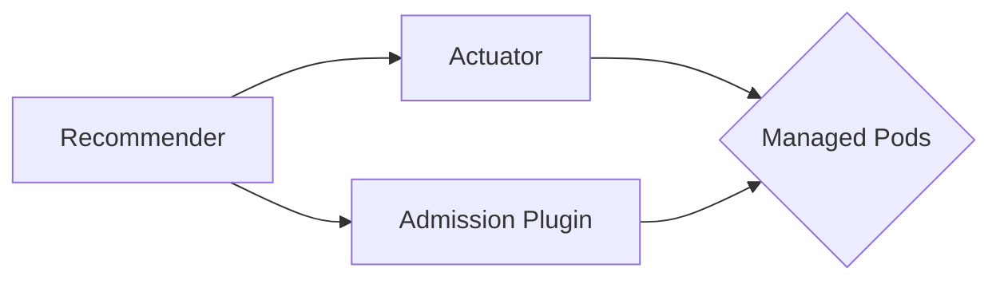
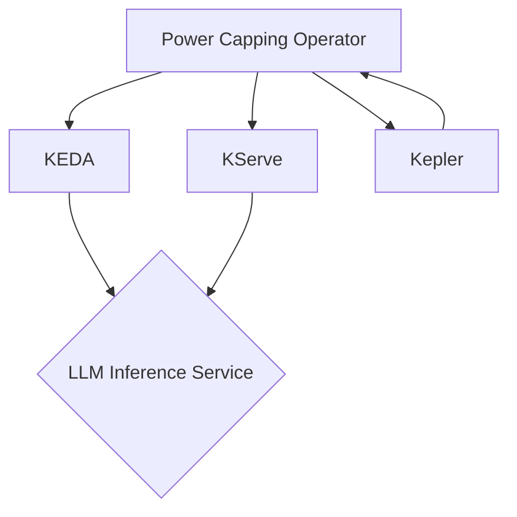

# Power-Capped LLM Inference Service using Kubernetes

## 1. Overview

The purpose of this project is to create a scalable and power-efficient Large Language Model (LLM) inference service
using Kubernetes. The service utilizes a custom power capping operator that accepts a Custom Resource Definition (CRD)
to specify the power capping limit. The operator
uses [KEDA (Kubernetes Event-Driven Autoscaling)](https://github.com/kedacore/keda) to scale the LLM inference service
deployment based on the specified power cap. [Kepler](https://github.com/sustainable-computing-io/kepler), a power
monitoring tool, is used to monitor the power consumption of CPU and GPU resources on the server.

In addition to server-level power capping, the operator also considers rack-level heating issues and incorporates
techniques for monitoring, capping, and scheduling workloads to reduce cooling requirements at the rack level. By
leveraging rack-aware scheduling algorithms, the operator aims to minimize heat recirculation and optimize the placement
of workloads across servers and racks.

## 2. Motivation

Data centers face the challenge of efficiently utilizing their compute resources while ensuring that power and cooling
constraints are not exceeded. Overpower and overheat incidents can lead to hardware damage, service disruptions, and
increased operational costs. This project aims to provide a solution that enables data centers to evenly distribute
workloads in time and space, reducing the risk of overpower or overheat incidents.

By implementing a power capping operator in Kubernetes, data centers can dynamically manage the power consumption of LLM
inference workloads at both the server and rack levels. The operator optimizes workload placement and resource
allocation to minimize power consumption, reduce cooling requirements, and ensure compliance with power cap limits and
rack-level constraints.

## 3. Architecture

The power capping operator follows an architecture similar to the Kubernetes Vertical Pod Autoscaler (VPA) controller.
It consists of three main components:

1. Recommender: Monitors the current and past resource and power consumption, and provides recommended actions for the
   actuator based on the defined policies.
2. Actuator: Checks which of the managed pods have correct power consumption set and, if not, kills or migrates them to
   conform to the power capping and performance-power ratio policy.
3. Admission Plugin: Sets the correct resource requests on new pods and issues alerts for passive actuators.



The power capping operator integrates with existing Kubernetes tools and frameworks, such as KEDA for event-driven
autoscaling, KServe for serving LLM inference workloads, and Kepler for power monitoring. It leverages these tools to
optimize power consumption and workload placement based on the defined policies and constraints.



Out of the box, the power capping operator includes batteries for Power Oversubscription and Performance-Power Ratio
Optimization scenarios. These batteries serve as examples of how the system functions in simple scenarios. Data centers
can develop or purchase more advanced algorithms from the marketplace to cover specific needs and use cases.

## 4. Installation

To install the power capping operator, follow these steps:

1. Clone the repository:

   ```bash
   git clone https://github.com/Climatik-Project/Climatik-Project
   ```

2. Set up Github PAT to use ghcr.io

   ```bash
   export GITHUB_PAT=<your-personal-access-token>
   ```

3. Create secret with Github Username & Repo name for Kubernetes:

   ```bash
   kubectl create secret generic github-secret \
         --from-literal=GITHUB_USERNAME=$GITHUB_USERNAME \
         --from-literal=GITHUB_REPO=$GITHUB_REPO
   ```

4. Install the necessary CRDs and operators:

   ```bash
   kubectl create secret generic github-secret \
      --from-literal=GITHUB_USERNAME=$GITHUB_USERNAME \
      --from-literal=GITHUB_REPO=$GITHUB_REPO
   kubectl apply -f deploy/climatik-operator/manifests/crd.yaml
   kubectl apply -f deploy/climatik-operator/manifests/sample_powercapping.yaml
   kubectl apply -f deploy/climatik-operator/manifests/deployment.yaml
   ```

5. Configure the power capping CRD with the desired power cap limit, rack-level constraints, and other parameters. Refer
   to the [CRD documentation](docs/crd.md) for more details.

## 5. Usage

To reduce the risk of interrupting production workloads, data centers can initially use the power capping operator as a
pure observability and recommendation tool after installation. The operator will provide alerts and recommendations
based on the defined policies and constraints. Data center operators can manually review these recommendations and
decide whether to take the suggested actions.

The power capping operator will log the system behaviors and provide a summary and comparison of the scenarios where the
recommended actions were taken or not taken. If the recommendations are accepted, the system will simulate the behavior
of not taking the actions, and vice versa. This allows data centers to make informed decisions based on real data and
gradually adopt the power capping operator to automatically manage more workloads and use cases.

It's important to note that the power capping operator only installs the necessary CRDs and operators, and allows for
configuration of the parameters. The LLM inference services themselves are deployed and managed by other systems like
KServe and vLLM. The power capping operator will only affect the scaling behavior of these services to reach the
optimization goals, such as energy capping or efficiency.

## 6. Documentation

- [Architecture](doc/architecture.md)
- [CRD Documentation](doc/crd.md)
- [Integration with Kubernetes Tools](doc/integrations.md)
- [Custom Algorithms Marketplace](doc/marketplace.md)

## 7. Contributing

Contributions to the project are welcome! If you find any issues or have suggestions for improvement, please open an
issue or submit a pull request on the [GitHub repository](https://github.com/Climatik-Project/Climatik-Project).

## 8. License

This project is licensed under the [Apache License 2.0](LICENSE).

## 9. Contact

For any questions or inquiries, please contact the project [MAINTAINERS](MAINTAINERS.md).