# Power-Capped LLM Inference Service using Kubernetes

## 1. Overview

The purpose of this project is to create a scalable and power-efficient LLM (Large Language Model) inference service
using Kubernetes. The service will utilize a custom power capping operator that accepts a Custom Resource Definition (
CRD) to specify the power capping limit. The operator will use [KEDA (Kubernetes Event-Driven Autoscaling)](https://github.com/kedacore/keda) to scale the
LLM inference service deployment based on the specified power cap. [Kepler](https://github.com/sustainable-computing-io/kepler), a power monitoring tool, will be used to
monitor the power consumption of CPU and GPU resources on the server.

In addition to server-level power capping, the operator will also consider rack-level heating issues and incorporate
techniques for monitoring, capping, and scheduling workload to reduce cooling requirements at the rack level. By
leveraging rack-aware scheduling algorithms, the operator aims to minimize heat recirculation and optimize the placement
of workload across servers and racks.

Please see [BENEFITS](doc/designs/BENEFITS.md) for a detailed description of the motivations of this project. [Problem Statement](doc/designs/problem-statement.md) provides a detailed power performance optimization problem statement.

## 2. Architecture

### 2.1 Components

- Power Capping Operator: A custom Kubernetes operator that manages the power capping functionality of the LLM inference
  service at both server and rack levels.
- Custom Resource Definition (CRD): Defines the power capping limit, rack-level constraints, and other configuration
  parameters for the LLM inference service.
- [KEDA](https://github.com/kedacore/keda): Kubernetes Event-Driven Autoscaling tool that scales the LLM inference service deployment based on the power
  consumption metrics and rack-level constraints.
- LLM Inference Service: A Kubernetes deployment that runs the LLM inference workload.
- [Kepler](https://github.com/sustainable-computing-io/kepler): A power monitoring tool that measures the power consumption of CPU and GPU resources on the server.
- Rack-aware Scheduling: Algorithms and techniques for monitoring, capping, and scheduling workload to reduce cooling
  requirements at the rack level.

### 2.2 Flow Chart

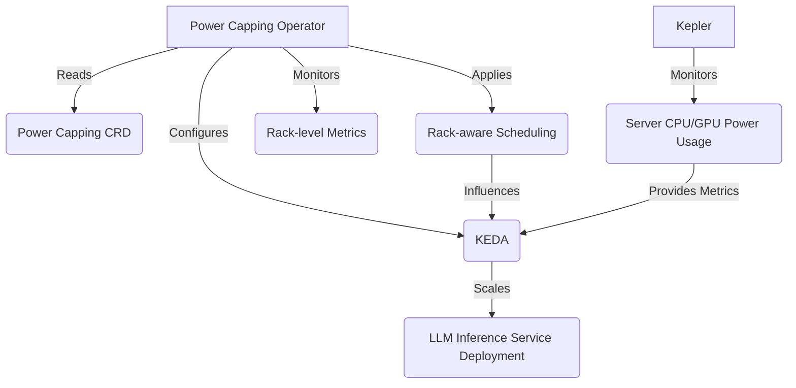

## 3. Power Capping Operator

### 3.1 Functionality

- Reads the power capping CRD to obtain the power capping limit, rack-level constraints, and other configuration
  parameters.
- Configures the referenced KEDA `ScaledObject` to scale the LLM inference service deployment based on the power
  consumption metrics provided by Kepler and the rack-level constraints.
- Continuously monitors the power consumption metrics and rack-level metrics, and adjusts the scaling configuration if
  necessary.
- Applies rack-aware scheduling algorithms to optimize the placement of workload across servers and racks, considering
  rack-level heating issues and cooling requirements.

### 3.2 API Spec

```yaml
apiVersion: powercapping.climatik-project.ai/v1
kind: PowerCappingConfig
metadata:
  name: llm-inference-power-cap
spec:
  powerCapLimit: <power_cap_limit_in_watts>
  deploymentName: <llm_inference_service_deployment_name>
  scaleObjectRef:
    - apiVersion: keda.sh/v1alpha1
      kind: ScaledObject
      metadata:
        name: <scale_object_name_1>
    - apiVersion: keda.sh/v1alpha1
      kind: ScaledObject
      metadata:
        name: <scale_object_name_2>
  metrics:
    - type: Prometheus
      prometheusAddress: <prometheus_server_address>
      query: <prometheus_query_for_power_consumption>
      threshold: <power_consumption_threshold>
  rackConstraints:
    - rackId: <rack_id_1>
      maxPower: <max_power_for_rack_1>
      maxTemperature: <max_temperature_for_rack_1>
    - rackId: <rack_id_2>
      maxPower: <max_power_for_rack_2>
      maxTemperature: <max_temperature_for_rack_2>
```

## 4. KEDA Configuration

- KEDA will be configured to scale the LLM inference service deployment based on the power consumption metrics provided
  by Kepler and the rack-level constraints defined in the power capping CRD.
- The scaling configuration will be managed by the power capping operator, considering both server-level and rack-level
  power and temperature thresholds.
- KEDA will ensure that the number of replicas stays within the specified minimum and maximum limits while respecting
  the rack-level constraints.

## 5. LLM Inference Service Deployment

- A standard Kubernetes deployment that runs the LLM inference workload.
- The deployment will be scaled by KEDA based on the power consumption metrics and rack-level constraints.
- The power capping operator will apply rack-aware scheduling techniques to optimize the placement of workload across
  servers and racks, considering rack-level heating issues and cooling requirements.

## 6. Kepler Integration

- Kepler will be deployed on the server to monitor the power consumption of CPU and GPU resources.
- Kepler will expose the power consumption metrics to the power capping operator via Prometheus.
- The power capping operator will utilize the power consumption metrics provided by Kepler to make scaling and workload
  placement decisions.

## 7. Rack-aware Scheduling

- The power capping operator will incorporate rack-aware scheduling algorithms and techniques to optimize the placement
  of workload across servers and racks.
- The operator will monitor rack-level metrics such as power consumption, temperature, and airflow to identify potential
  hotspots and cooling inefficiencies.
- Based on the rack-level metrics and constraints defined in the power capping CRD, the operator will make intelligent
  workload placement decisions to minimize heat recirculation and reduce cooling requirements.
- The operator will leverage techniques such as zone-based discretization (ZBD) and minimize-heat-recirculation (MinHR)
  to optimize workload placement at the rack level.
- The rack-aware scheduling decisions will influence the scaling behavior of KEDA, ensuring that workload is distributed
  efficiently across servers and racks while respecting power and temperature constraints.

## 8. Integration

### 8.1 KServe Integration

This section demonstrates the integration of the power capping operator with KServe, a standardized Serverless ML
Inference Platform on Kubernetes. KServe creates deployments for serving LLM inference and associated KEDA ScaledObjects.
The power capping operator then updates the CRD to manage the power capping configuration and apply rack-aware
scheduling techniques.

### 8.1.1 Integration Flow

1. KServe creates a deployment for serving LLM inference.
2. KServe creates an associated KEDA ScaledObject for the deployment.
3. The power capping operator watches for changes in the KServe deployments and ScaledObjects.
4. The power capping operator updates the PowerCappingConfig CRD with the ScaledObject references and rack-level
   constraints.
5. The power capping operator monitors the power consumption metrics and rack-level metrics, and adjusts the scaling
   configuration for the new ScaledObject if necessary.
6. The power capping operator applies rack-aware scheduling algorithms to optimize the placement of workload across
   servers and racks, considering rack-level heating issues and cooling requirements.

### 8.1.2 Integration Diagram

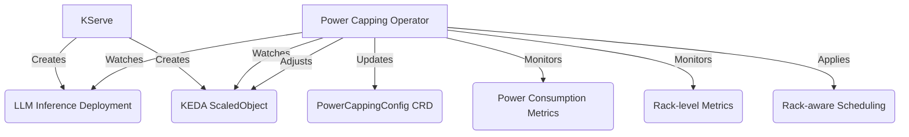

### 8.1.3 KServe Integration Steps

1. KServe creates a deployment for serving LLM inference using the InferenceService resource.
   ```yaml
   apiVersion: serving.kserve.io/v1beta1
   kind: InferenceService
   metadata:
     name: llm-inference-service
   spec:
     predictor:
       serviceAccountName: sa
       containers:
       - image: llm-inference-service:latest
         name: llm-inference-service
   ```

2. KServe creates an associated KEDA ScaledObject for the deployment.
   ```yaml
   apiVersion: keda.sh/v1alpha1
   kind: ScaledObject
   metadata:
     name: llm-inference-scaledobject
   spec:
     scaleTargetRef:
       apiVersion: apps/v1
       kind: Deployment
       name: llm-inference-service
     pollingInterval: 15
     cooldownPeriod: 30
     minReplicaCount: 1
     maxReplicaCount: 10
     triggers:
       - type: prometheus
         metadata:
           serverAddress: http://prometheus-server
           metricName: average_token_per_second
           query: average_token_per_second[1m]
           threshold: "500"
   ```

3. The power capping operator watches for changes in the KServe deployments and ScaledObjects.

4. The power capping operator updates the PowerCappingConfig CRD with the ScaledObject references and rack-level
   constraints.
   ```yaml
   apiVersion: powercapping.climatik-project.ai/v1
   kind: PowerCappingConfig
   metadata:
     name: llm-inference-power-cap
   spec:
     powerCapLimit: 1000
     scaleObjectRef:
       - apiVersion: keda.sh/v1alpha1
         kind: ScaledObject
         metadata:
           name: llm-inference-scaledobject
     rackConstraints:
       - rackId: rack-1
         maxPower: 2000
         maxTemperature: 30
       - rackId: rack-2
         maxPower: 1500
         maxTemperature: 28
   ```

5. The power capping operator monitors the power consumption metrics and rack-level metrics, and adjusts the scaling
   configuration if necessary.

6. The power capping operator applies rack-aware scheduling algorithms to optimize the placement of workload across
   servers and racks, considering rack-level heating issues and cooling requirements.

This integration allows the power capping operator to seamlessly work with KServe deployments, manage their power
capping configuration using KEDA ScaledObjects, and apply rack-aware scheduling techniques to optimize workload
placement and reduce cooling requirements.

### 8.2 Integration with vLLM

The power capping operator can also be integrated with vLLM, a framework for serving large language models. vLLM
provides a memory-efficient and scalable solution for deploying and serving LLMs.

### 8.2.1 vLLM Deployment

vLLM creates deployments for serving LLM inference. Each vLLM deployment is associated with a KEDA ScaledObject that
defines the scaling behavior based on the incoming workload and rack-level constraints.

Here's an example of a vLLM deployment:

```yaml
apiVersion: apps/v1
kind: Deployment
metadata:
  name: vllm-deployment
spec:
  replicas: 1
  selector:
    matchLabels:
      app: vllm
  template:
    metadata:
      labels:
        app: vllm
    spec:
      containers:
        - name: vllm
          image: vllm/vllm-openai:latest
          ports:
            - containerPort: 8000
```

### 8.2.2 KEDA ScaledObject for vLLM

The KEDA ScaledObject associated with the vLLM deployment defines the scaling rules based on the incoming requests,
desired target metrics, and rack-level constraints.

Here's an example of a KEDA ScaledObject for vLLM:

```yaml
apiVersion: keda.sh/v1alpha1
kind: ScaledObject
metadata:
  name: vllm-scaledobject
spec:
  scaleTargetRef:
    apiVersion: apps/v1
    kind: Deployment
    name: vllm-deployment
  pollingInterval: 15
  cooldownPeriod: 30
  minReplicaCount: 1
  maxReplicaCount: 10
  triggers:
    - type: prometheus
      metadata:
        serverAddress: http://prometheus-server
        metricName: http_requests_total
        threshold: "100"
        query: average_token_throughput_per_second[1m]
  rackConstraints:
    - rackId: rack-1
      maxPower: 2000
      maxTemperature: 30
    - rackId: rack-2
      maxPower: 1500
      maxTemperature: 28
```

### 8.2.3 Power Capping Operator Integration

The power capping operator integrates with vLLM deployments in the same way as it does with KServe. It watches for
changes in the vLLM deployments and their associated KEDA ScaledObjects.

The power capping operator performs the following steps:

1. Monitors the power consumption metrics from Kepler and the rack-level metrics for the vLLM deployments.
2. Retrieves the KEDA ScaledObject associated with each vLLM deployment.
3. Adjusts the `maxReplicaCount` of the KEDA ScaledObject based on the power consumption metrics, rack-level
   constraints, and the defined power capping rules.
4. Applies rack-aware scheduling algorithms to optimize the placement of workload across servers and racks, considering
   rack-level heating issues and cooling requirements.
5. Updates the KEDA ScaledObject to enforce the power capping limits and rack-level constraints.

The integration with vLLM ensures that the power capping operator can effectively manage the power consumption of vLLM
deployments, apply rack-aware scheduling techniques to optimize workload placement, and reduce cooling requirements,
similar to how it manages KServe deployments.

### 8.2.4 Integration Diagram

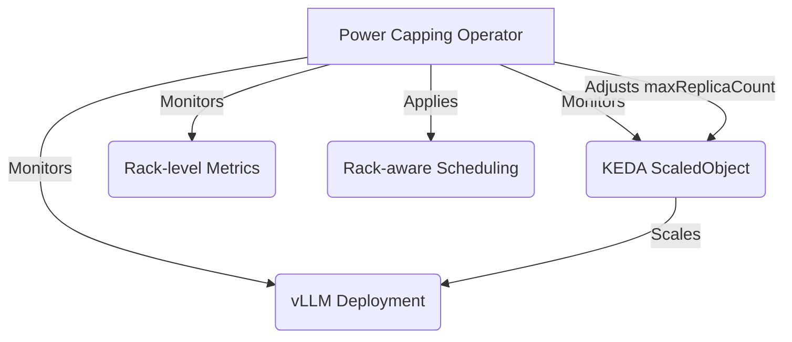

The diagram illustrates the integration flow between the power capping operator, vLLM deployment, KEDA ScaledObject,
and rack-level metrics. The power capping operator monitors the vLLM deployment, its associated KEDA ScaledObject, and
rack-level metrics. It adjusts the `maxReplicaCount` based on the power consumption metrics and rack-level constraints,
applies rack-aware scheduling techniques to optimize workload placement, and updates the KEDA ScaledObject to enforce
the power capping limits and rack-level constraints.

By integrating with vLLM, the power capping operator extends its capabilities to manage the power consumption of LLM
inference deployments across multiple frameworks, providing a comprehensive solution for power-efficient and scalable
LLM serving while considering rack-level heating issues and cooling requirements.

To integrate real-time carbon intensity for dynamic power capping and achieve the target carbon capping, we need to
modify the power capping operator to fetch the carbon intensity data from an external source and adjust the power cap
accordingly. Here's an updated integration section that includes this functionality:

## 8.3 Integration with Real-Time Carbon Intensity

In this integration, we enhance the power capping operator to utilize real-time carbon intensity data for dynamic power
capping. The goal is to achieve a target carbon capping by adjusting the power cap based on the current carbon
intensity.

### 8.3.1 Carbon Intensity Data Source

To obtain real-time carbon intensity data, we can use an external API or data source that provides this information. For
example, we can use
the [Carbon Intensity API](https://carbon-intensity.github.io/api-definitions/#carbon-intensity-api-v2-0-0) provided by
the National Grid ESO in the UK. This API offers real-time and forecasted carbon intensity data for the UK electricity
grid.

### 8.3.2 Calculating Carbon Emission

To calculate the carbon emission, we multiply the current power usage by the carbon intensity. The power usage can be
obtained from the Kepler Prometheus metrics, as described in the previous sections. This step omits the detail of PUE (
Power Usage Effectiveness) and other factors that may affect the carbon emission calculation.

### 8.3.3 Adjusting Power Cap based on Carbon Intensity

The power capping operator can dynamically adjust the power cap based on the current carbon intensity to achieve the
target carbon capping. When the carbon intensity is high, the power cap is reduced to limit the carbon emission.
Conversely, when the carbon intensity is low, the power cap can be increased to allow higher power usage.

### 8.3.4 Integration with Power Capping Operator

To integrate the carbon intensity-based power capping into the existing power capping operator, we need to modify
the `monitor_power_usage` function to include the following steps:

1. Fetch the current carbon intensity.
2. Calculate the carbon emission.
3. Adjust the power cap based on the current carbon intensity and target carbon cap.
4. Apply rack-aware scheduling algorithms to optimize workload placement across servers and racks, considering carbon
   emission and cooling requirements.
5. Update the power capping configuration with the adjusted power cap.

### 8.3.5 Integration Diagram

Here's a diagram illustrating the integration of real-time carbon intensity with the power capping operator:

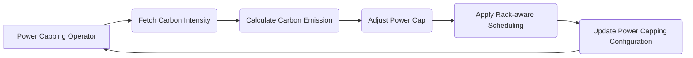

In this diagram:

1. The power capping operator fetches the current carbon intensity from the external data source.
2. It calculates the carbon emission based on the current power usage and carbon intensity.
3. The power cap is adjusted based on the carbon intensity and target carbon cap.
4. Rack-aware scheduling algorithms are applied to optimize workload placement across servers and racks, considering
   carbon emission and cooling requirements.
5. The power capping configuration is updated with the adjusted power cap.
6. The process continues in a loop, with the power capping operator continuously monitoring and adjusting the power cap
   based on the real-time carbon intensity and rack-level constraints.

By integrating real-time carbon intensity into the power capping operator, we can dynamically adjust the power cap to
achieve the target carbon capping while applying rack-aware scheduling techniques to optimize workload placement and
reduce cooling requirements. This allows for more environmentally-friendly operation of the system while still
maintaining the desired performance characteristics.

## 8.4 Kubernetes Vertical Pod Autoscaler (VPA) Integration

In this integration, we leverage the Kubernetes Vertical Pod Autoscaler (VPA) to dynamically
adjust the resource requirements of pods based on the workload demands, resource availability, and rack-level
constraints. VPA complements the horizontal scaling capabilities of KEDA by optimizing the resource allocation for each
pod.

### 8.4.1 VPA Configuration

To enable VPA for the LLM inference workloads, we need to create a VPA resource that specifies the
target deployments and the desired resource recommendations. Here's an example VPA configuration:

```yaml
apiVersion: autoscaling.k8s.io/v1
kind: VerticalPodAutoscaler
metadata:
  name: llm-inference-vpa
spec:
  targetRef:
    apiVersion: "apps/v1"
    kind: Deployment
    name: llm-inference-deployment
  updatePolicy:
    updateMode: "Auto"
  resourcePolicy:
    containerPolicies:
      - containerName: "*"
        minAllowed:
          cpu: 100m
          memory: 256Mi
          nvidia.com/gpu: 1
        maxAllowed:
          cpu: 4
          memory: 16Gi
          nvidia.com/gpu: 8
        controlledResources: ["cpu", "memory", "nvidia.com/gpu"]
  rackConstraints:
    - rackId: rack-1
      maxPower: 2000
      maxTemperature: 30
    - rackId: rack-2
      maxPower: 1500
      maxTemperature: 28
```

In this configuration, we specify the target deployment (`llm-inference-deployment`) and define
the resource policy for the containers. The `minAllowed` and `maxAllowed` fields set the minimum and maximum
resource limits for CPU and memory. VPA will recommend resource adjustments within these boundaries based on
the observed workload requirements. Additionally, we include rack-level constraints to ensure that the resource
recommendations align with the rack-level power and temperature limits.

### 8.4.2 Integration with KEDA

To integrate VPA with KEDA, we need to ensure that the resource recommendations made by VPA are considered during the
scaling process. KEDA can be configured to use the VPA-recommended resource values when scaling the pods.

Here's an example KEDA ScaledObject that incorporates VPA recommendations:

```yaml
apiVersion: keda.sh/v1alpha1
kind: ScaledObject
metadata:
  name: llm-inference-scaledobject
spec:
  scaleTargetRef:
    apiVersion: apps/v1
    kind: Deployment
    name: llm-inference-deployment
  pollingInterval: 15
  cooldownPeriod: 30
  minReplicaCount: 1
  maxReplicaCount: 10
  advanced:
    restoreToOriginalReplicaCount: true
    verticalPodAutoscalerConfig:
      behavior:
        scaleDown:
          stabilizationWindowSeconds: 60
          policies:
          - type: Percent
            value: 100
            periodSeconds: 15
  triggers:
  - type: prometheus
    metadata:
      serverAddress: http://prometheus-server
      metricName: average_token_per_second
      threshold: 100
  rackConstraints:
    - rackId: rack-1
      maxPower: 2000
      maxTemperature: 30
    - rackId: rack-2
      maxPower: 1500
      maxTemperature: 28
```

_NOTE: KEDA is still not supporting VPA, see [KEDA Issus #5435](https://github.com/kedacore/keda/issues/5435)_

### 8.4.3 Resource Adjustment based on LLM Model Size

VPA can be particularly useful when dealing with different LLM model sizes. Larger models may require more GPU/CPU
resources, while smaller models can operate with fewer resources. VPA can automatically adjust the resource claims based
on the model size and the observed resource utilization.

For example, if a larger LLM model is deployed, VPA can increase the GPU/CPU resource claim to ensure optimal performance
while adhering to the rack-level power and temperature constraints. Conversely, if a smaller model is used, VPA can
reduce the GPU/CPU resource claim to avoid over-allocation and improve resource and power consumption efficiency.

### 8.4.4 Handling GPU Resource Fragmentation

In situations where the Kubernetes cluster experiences GPU resource fragmentation, VPA can help optimize the resource
allocation. VPA can recommend adjusting the GPU/CPU resource claims of pods to fit the available GPU resources more
efficiently while considering the rack-level constraints.

For instance, if a pod requires 2 GPUs but the cluster has fragmented GPU resources with 1 GPU available on multiple
nodes, VPA can recommend reducing the GPU resource claim to 1 GPU per pod. This allows the pods to be scheduled on nodes
with available GPU resources, thereby improving overall utilization and reducing fragmentation.

### 8.4.5 Integration Diagram

Here's a diagram illustrating the integration of VPA with KEDA and the power capping operator:

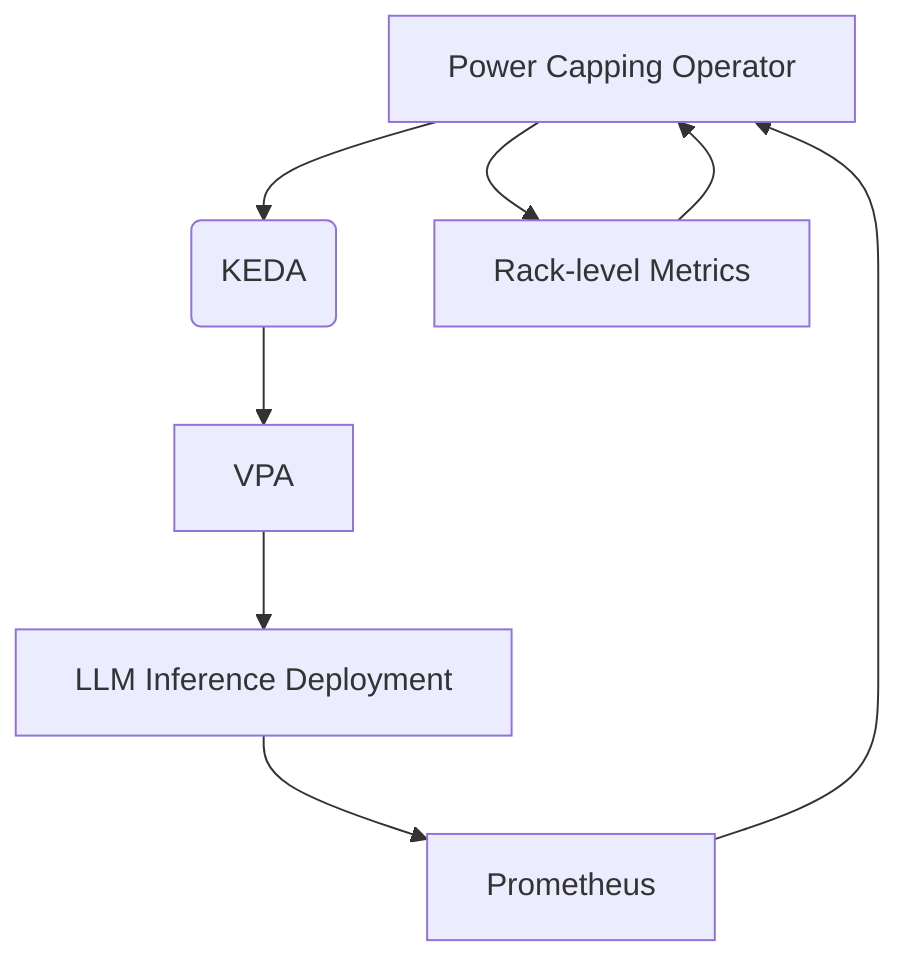

In this diagram:

1. The power capping operator interacts with KEDA to manage the scaling of the LLM inference deployment.
2. KEDA integrates with VPA to obtain resource recommendations based on the workload requirements, resource
   availability, and rack-level constraints.
3. VPA analyzes the resource utilization of the LLM inference deployment and provides recommendations for resource
   adjustments, considering rack-level power and temperature limits.
4. The LLM inference deployment is scaled and its resources are adjusted based on the recommendations from VPA and the
   scaling policies defined in KEDA.
5. Prometheus monitors the LLM inference deployment and provides metrics to the power capping operator for
   decision-making.
6. The power capping operator monitors rack-level metrics such as power consumption and temperature to ensure compliance
   with rack-level constraints.

By integrating VPA with KEDA and the power capping operator, we can achieve more efficient resource utilization and
improved performance for LLM inference workloads while adhering to rack-level power and temperature constraints. VPA
ensures that the pods are allocated the appropriate amount of resources based on the workload demands, resource
availability, and rack-level constraints, while KEDA handles the horizontal scaling of the pods. The power capping
operator can then make informed decisions based on the resource utilization, power consumption metrics, and rack-level
constraints to maintain the desired power limits and optimize workload placement across servers and racks.

## 9. Power Capping Operator in Action

This section illustrates how the power capping operator works in a real-world scenario. The operator continuously
monitors the power consumption metrics provided by Kepler, rack-level metrics, and carbon intensity data. It makes
adjustments to the KEDA ScaledObjects based on the current power usage, rack-level constraints, and carbon emission
targets.

### 9.1 Monitoring Power Usage and Rack-level Metrics

The power capping operator periodically retrieves the power consumption metrics from Kepler and the rack-level metrics
such as power consumption and temperature. It calculates the total power being used by the LLM inference deployments at
any given time and compares it against the power cap limit specified in the PowerCappingConfig CRD. Additionally, it
checks the rack-level power and temperature metrics to ensure compliance with the defined constraints.

### 9.2 Applying Rack-aware Scheduling

Based on the power consumption metrics and rack-level constraints, the power capping operator applies rack-aware
scheduling algorithms to optimize the placement of workload across servers and racks. It considers factors such as power
usage, temperature, and cooling requirements to minimize heat recirculation and reduce cooling costs.

The operator leverages techniques such as zone-based discretization (ZBD) and minimize-heat-recirculation (MinHR) to
make intelligent workload placement decisions. It assigns workload to servers and racks in a manner that balances power
consumption, avoids hotspots, and improves overall cooling efficiency.

### 9.3 Adjusting KEDA ScaledObjects

Based on the current power usage, rack-level constraints, and carbon emission targets, the power capping operator
adjusts the `maxReplicaCount` of the KEDA ScaledObjects associated with the LLM inference deployments. The following
scenarios describe how the operator handles different power usage levels:

1. Power usage below the power cap limit and rack-level constraints:
    - If the current power usage is below the power cap limit and the rack-level power and temperature metrics are
      within the defined constraints, the operator makes no changes to the KEDA ScaledObjects.
    - The LLM inference deployments can scale up or down based on their configured scaling rules.

2. Power usage at 80% of the power cap limit or approaching rack-level constraints:
    - If the current power usage reaches 80% of the power cap limit or the rack-level metrics are approaching the
      defined constraints, the operator sets the `maxReplicaCount` of the KEDA ScaledObjects to one above the current
      number of replicas.
    - This allows for a small buffer for scaling up while preventing excessive power consumption and ensuring compliance
      with rack-level constraints.

3. Power usage at 95% of the power cap limit or exceeding rack-level constraints:
    - If the current power usage reaches 95% of the power cap limit or the rack-level metrics exceed the defined
      constraints, the operator sets the `maxReplicaCount` of the KEDA ScaledObjects to the current number of replicas.
    - This prevents any further scaling up of the LLM inference deployments to ensure the power usage stays within the
      power cap limit and the rack-level constraints are not violated.

### 9.4 Adjusting Power Cap based on Carbon Intensity

The power capping operator fetches the real-time carbon intensity data from an external source and adjusts the power cap
based on the current carbon intensity and the target carbon emission. When the carbon intensity is high, the operator
reduces the power cap to limit carbon emissions. Conversely, when the carbon intensity is low, the operator increases
the power cap to allow higher power usage while still meeting the carbon emission targets.

The operator dynamically adjusts the power cap and applies rack-aware scheduling algorithms to optimize workload
placement across servers and racks, considering both power consumption and carbon emission goals.

### 9.5 Power Capping Flowchart

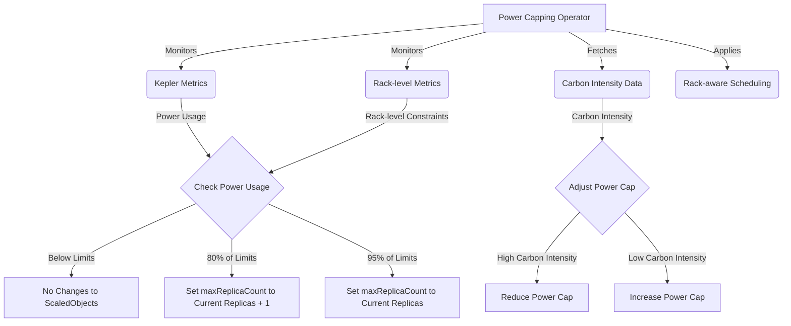

The flowchart above illustrates the decision-making process of the power capping operator based on the current power
usage, rack-level constraints, and carbon intensity:

1. The power capping operator monitors the Kepler metrics to obtain the current power usage.
2. It monitors the rack-level metrics to ensure compliance with the defined power and temperature constraints.
3. The operator fetches the real-time carbon intensity data from an external source.
4. It checks the power usage and rack-level metrics against the power cap limit and rack-level constraints.
5. If the power usage is below the limits, no changes are made to the KEDA ScaledObjects.
6. If the power usage reaches 80% of the limits or approaches the rack-level constraints, the operator sets
   the `maxReplicaCount` of the KEDA ScaledObjects to one above the current number of replicas.
7. If the power usage reaches 95% of the limits or exceeds the rack-level constraints, the operator sets
   the `maxReplicaCount` of the KEDA ScaledObjects to the current number of replicas.
8. The operator adjusts the power cap based on the current carbon intensity. If the carbon intensity is high, the power
   cap is reduced to limit carbon emissions. If the carbon intensity is low, the power cap is increased to allow higher
   power usage while meeting the carbon emission targets.
9. The operator applies rack-aware scheduling algorithms to optimize workload placement across servers and racks,
   considering power consumption, cooling requirements, and carbon emission goals.

By continuously monitoring power usage, rack-level metrics, and carbon intensity, and adjusting the KEDA ScaledObjects
and power cap accordingly, the power capping operator ensures that the LLM inference deployments operate within the
defined power cap limit, comply with rack-level constraints, and meet the carbon emission targets. This holistic
approach optimizes power efficiency, reduces cooling requirements, and promotes environmentally sustainable operation of
the LLM inference system.

## 10. Enhancements

This section discusses potential enhancements to the power capping operator and the LLM inference system to further
optimize power efficiency, performance, and carbon footprint.

### 10.1 Power Efficiency Aware LLM Inference Routing

One enhancement to the LLM inference system is to introduce power efficiency aware routing using a Layer 7 router, such
as Envoy or vLLM Router. The idea is to route LLM prompts to the LLM inference services that have the highest
token/watts ratio, indicating better power efficiency.

#### 10.1.1 Token/Watts Metric

The token/watts metric represents the number of tokens processed per watt of power consumed by an LLM inference service.
This metric provides a measure of power efficiency, with higher values indicating more efficient processing.

The token/watts metric per Deployment can be calculated as follows:

```
token/watts = average_token_througput_per_second / sum(irate(kepler_container_joules_total))
```

This metric is exposed by the LLM inference services and collected by Prometheus, making it available for the power
capping operator and the Layer 7 router.

#### 10.1.2 Layer 7 Router

A Layer 7 router is introduced to handle the routing of LLM prompts to the most power-efficient LLM inference services.
The router considers the token/watts metric when making routing decisions.

The Layer 7 router performs the following steps:

1. Receives an LLM prompt from a client.
2. Retrieves the token/watts metrics for all available LLM inference services from Prometheus.
3. Selects the LLM inference service with the highest token/watts ratio.
4. Routes the LLM prompt to the selected LLM inference service for processing.

By routing prompts to the most power-efficient services, the Layer 7 router optimizes the overall power efficiency of
the LLM inference system.

#### 10.1.3 Power Capping Operator Enhancement

The power capping operator can be enhanced to consider the token/watts metric when adjusting the `maxReplicaCount` of
the KEDA ScaledObjects associated with the LLM inference deployments.

The enhanced power capping operator performs the following steps:

1. Monitors the power consumption metrics from Kepler, the rack-level metrics, and the token/watts metrics from
   Prometheus.
2. Identifies the LLM inference deployments with higher token/watts ratios.
3. Prioritizes the deployments with higher token/watts ratios by allowing a higher number of maximum replicas compared
   to less efficient deployments, while still adhering to the rack-level constraints.
4. Adjusts the `maxReplicaCount` of the KEDA ScaledObjects based on the power usage, rack-level constraints, and the
   priority assigned to each deployment.

By selectively allowing a higher number of replicas for more power-efficient deployments, the power capping operator
ensures that the overall power efficiency of the LLM inference system is optimized while still adhering to the power cap
limit and rack-level constraints.

### 10.1.4 Enhancement Flowchart

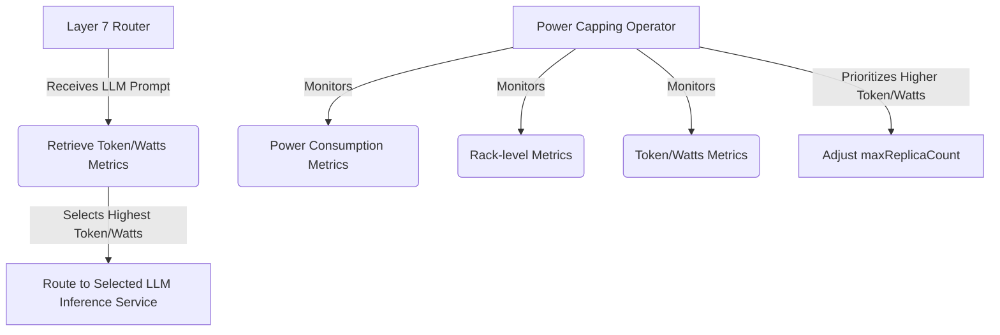

The flowchart above illustrates the power efficiency aware LLM inference routing enhancement:

1. The Layer 7 router receives an LLM prompt.
2. It retrieves the token/watts metrics for available LLM inference services.
3. The router selects the LLM inference service with the highest token/watts ratio.
4. The LLM prompt is routed to the selected LLM inference service for processing.
5. The power capping operator monitors the power consumption metrics, rack-level metrics, and token/watts metrics.
6. It prioritizes the deployments with higher token/watts ratios while considering rack-level constraints.
7. The operator adjusts the `maxReplicaCount` of the KEDA ScaledObjects based on the power usage, rack-level
   constraints, and the assigned priorities.

By incorporating power efficiency aware routing and enhancing the power capping operator, the LLM inference system can
optimize its power efficiency while maintaining the desired performance levels, adhering to the power cap limit, and
respecting rack-level constraints.

### 10.2 GPU Frequency Tuning for Optimal Power Efficiency

Another enhancement to improve the power efficiency and performance of the LLM inference system is to introduce a GPU
frequency tuning mechanism. This enhancement involves creating an external Kubernetes job that adjusts the GPU frequency
to optimize the token/watts ratio and the maximum number of replicas while ensuring the power cap and rack-level
constraints are not violated.

#### 10.2.1 GPU Frequency Tuning Job

The GPU frequency tuning job is a Kubernetes job that runs periodically or can be triggered based on certain events. The
job performs the following tasks:

1. Retrieves the current power consumption metrics from Kepler, the token/watts metrics from Prometheus, and the
   rack-level metrics for each LLM inference deployment.
2. Analyzes the metrics to determine if adjusting the GPU frequency can improve the token/watts ratio and the maximum
   number of replicas.
3. Calculates the optimal GPU frequency for each LLM inference deployment based on the metrics, the power cap limit, and
   the rack-level constraints.
4. Applies the new GPU frequency settings to the LLM inference deployments using the appropriate GPU management tools or
   APIs.

By tuning the GPU frequency, the job aims to find the sweet spot where the token/watts ratio is maximized while allowing
for a higher number of replicas, ultimately improving the overall token throughput of the LLM inference system.

#### 10.2.2 Integration with Power Capping Operator

The power capping operator can be extended to interact with the GPU frequency tuning job. The operator can trigger the
job when certain conditions are met, such as when the power usage approaches the power cap limit, when the rack-level
constraints are being approached, or when there is a significant change in the token/watts metrics.

The power capping operator performs the following steps:

1. Monitors the power consumption metrics from Kepler, the rack-level metrics, and the token/watts metrics from
   Prometheus.
2. Analyzes the metrics to determine if GPU frequency tuning is required.
3. Triggers the GPU frequency tuning job with the necessary parameters and configurations.
4. Waits for the job to complete and receives the updated GPU frequency settings.
5. Updates the `maxReplicaCount` of the KEDA ScaledObjects based on the new GPU frequency settings, the power cap
   limit, and the rack-level constraints.

By integrating the GPU frequency tuning job with the power capping operator, the LLM inference system can dynamically
adjust the GPU frequency to optimize power efficiency and performance while adhering to the power cap limit and
rack-level constraints.

#### 10.2.3 Enhancement Flowchart

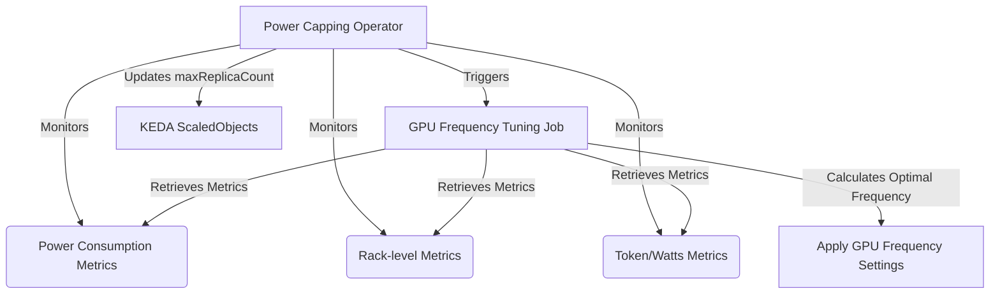

The flowchart above illustrates the GPU frequency tuning enhancement:

1. The power capping operator monitors the power consumption metrics, rack-level metrics, and token/watts metrics.
2. It analyzes the metrics to determine if GPU frequency tuning is required.
3. The operator triggers the GPU frequency tuning job with the necessary parameters.
4. The GPU frequency tuning job retrieves the metrics and calculates the optimal GPU frequency settings based on the
   power cap limit and rack-level constraints.
5. The power capping operator updates the `maxReplicaCount` of the KEDA ScaledObjects based on the updated GPU
   frequency settings, the power cap limit, and the rack-level constraints.

By incorporating GPU frequency tuning, the LLM inference system can further optimize its power efficiency and
performance, maximizing the token throughput while operating within the power cap limit and respecting rack-level
constraints. This enhancement complements the power efficiency aware routing and the power capping operator, providing a
comprehensive solution for efficient and scalable LLM inference in a Kubernetes environment.

### 10.3 Power Usage Smoothing

In this enhancement, we investigate how to apply the insights
from [the research](https://research.facebook.com/publications/smoothoperator-reducing-power-fragmentation-and-improving-power-utilization-in-large-scale-datacenters/)
on power utilization in Facebook datacenters to our power capping operator and KEDA. The main idea is to leverage the
heterogeneity of power consumption patterns among different services to re-shape the power profile of each power node by
re-distributing services. By grouping services with asynchronous peak times under the same power node, we can reduce the
peak power of each node, creating more power headroom to allow more servers to be hosted, achieving higher throughput.

#### 10.3.1 Workload-Aware Service Placement

The power capping operator is modified to include a workload-aware service placement component. This component analyzes
the power consumption patterns of different LLM inference services and systematically spreads the service instances with
synchronous power patterns evenly under the power supply tree. The placement is optimized to reduce the peak power draw
at power nodes while considering the rack-level constraints.

#### 10.3.2 Dynamic Power Profile Reshaping

The power capping operator is enhanced to dynamically reshape the power profile of each power node by utilizing the
headroom unlocked by the workload-aware service placement. It continuously monitors the power consumption patterns,
rack-level metrics, and adjusts the service placement and resource allocation accordingly, aiming to maximize the
utilization of the available power headroom while ensuring the power cap and rack-level constraints are not exceeded.

#### 10.3.3 Integration with KEDA

KEDA is extended to consider the power consumption patterns, the workload-aware service placement, and the rack-level
constraints when scaling the LLM inference services. The scaling rules are modified to take into account the power
headroom available at each power node, and the scaling behavior is adjusted to distribute the workload evenly across
power nodes with asynchronous peak times. KEDA collaborates with the power capping operator to ensure the scaling
actions align with the power usage smoothing strategy and respect the rack-level constraints.

#### 10.3.4 Monitoring and Analysis

The monitoring capabilities of the power capping operator are enhanced to collect and analyze power consumption patterns
of LLM inference services, as well as rack-level metrics. It integrates with Kepler and Prometheus to gather real-time
power usage data and performs data analysis to identify synchronous and asynchronous power consumption patterns among
services. The insights gained from the analysis are used to inform the workload-aware service placement and dynamic
power profile reshaping.

#### 10.3.5 Enhancement Flowchart

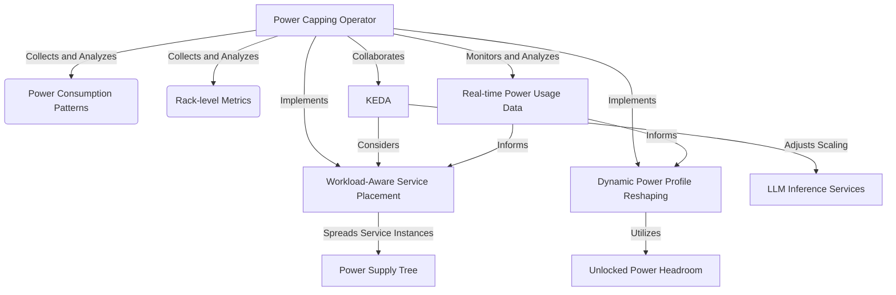

The flowchart above illustrates the power usage smoothing enhancement:

1. The power capping operator collects and analyzes power consumption patterns of LLM inference services and rack-level
   metrics.
2. It implements workload-aware service placement to spread service instances with synchronous power patterns evenly
   under the power supply tree, considering rack-level constraints.
3. The operator also implements dynamic power profile reshaping to utilize the unlocked power headroom while respecting
   the power cap and rack-level constraints.
4. KEDA collaborates with the power capping operator, considering the workload-aware service placement and adjusting the
   scaling behavior of LLM inference services.
5. The power capping operator continuously monitors and analyzes real-time power usage data and rack-level metrics to
   inform the ongoing optimization and adjustment of the power usage smoothing strategy.

By incorporating power usage smoothing into our power capping operator and KEDA, we can significantly improve power
utilization efficiency, increase throughput, and enhance the scalability of the LLM inference system within the
constraints of the existing power infrastructure and rack-level limitations.

### 10.4 Rack-aware Cooling Optimization

In this enhancement, we focus on optimizing the cooling efficiency at the rack level by leveraging the power capping
operator's awareness of rack-level metrics and workload placement. The goal is to minimize the cooling requirements and
reduce the overall cooling costs while ensuring the LLM inference system operates within the power cap limit and
rack-level constraints.

#### 10.4.1 Rack-level Cooling Metrics

The power capping operator is extended to collect and monitor additional rack-level cooling metrics, such as:

- Rack inlet temperature
- Rack exhaust temperature
- Rack airflow rate
- Cooling unit power consumption

These metrics provide insights into the cooling efficiency and heat distribution within each rack.

#### 10.4.2 Rack-aware Workload Placement

The power capping operator's rack-aware scheduling algorithms are enhanced to consider the cooling metrics when placing
workload across servers and racks. The operator aims to distribute the workload in a manner that minimizes the cooling
requirements and optimizes the cooling efficiency.

The enhanced rack-aware workload placement performs the following steps:

1. Analyzes the rack-level cooling metrics and identifies racks with better cooling efficiency and lower cooling
   requirements.
2. Prioritizes the placement of workload on servers within racks that have more efficient cooling and lower cooling
   demands.
3. Balances the workload distribution across racks to avoid overloading any particular rack and to maintain even cooling
   distribution.
4. Continuously monitors the rack-level cooling metrics and adjusts the workload placement as necessary to optimize
   cooling efficiency.

By considering the cooling metrics in the workload placement decisions, the power capping operator can reduce the
cooling requirements and improve the overall cooling efficiency at the rack level.

#### 10.4.3 Dynamic Cooling Control

The power capping operator can integrate with the data center's cooling management system to dynamically control the
cooling settings based on the rack-level metrics and workload distribution. The operator can adjust the cooling
parameters, such as the supply air temperature and airflow rate, to optimize the cooling efficiency and reduce energy
consumption.

The dynamic cooling control performs the following steps:

1. Monitors the rack-level cooling metrics and the workload distribution across racks.
2. Analyzes the cooling requirements based on the rack-level metrics and the heat generated by the workload.
3. Communicates with the cooling management system to adjust the cooling settings, such as increasing the supply air
   temperature or reducing the airflow rate, for racks with lower cooling demands.
4. Continuously adapts the cooling settings based on the changing workload distribution and rack-level metrics to
   maintain optimal cooling efficiency.

By dynamically controlling the cooling settings based on the actual cooling requirements, the power capping operator can
reduce the cooling energy consumption and improve the overall cooling efficiency of the data center.

#### 10.4.4 Integration with Power Capping Operator

The rack-aware cooling optimization is integrated into the existing power capping operator workflow. The operator
incorporates the cooling metrics and cooling control actions into its decision-making process.

The enhanced power capping operator performs the following steps:

1. Monitors the power consumption metrics, rack-level metrics (including cooling metrics), and token/watts metrics.
2. Applies the rack-aware workload placement algorithms, considering both power and cooling efficiency.
3. Adjusts the `maxReplicaCount` of the KEDA ScaledObjects based on the power usage, rack-level constraints, and cooling
   requirements.
4. Interacts with the cooling management system to dynamically control the cooling settings based on the rack-level
   metrics and workload distribution.
5. Continuously monitors and optimizes the workload placement and cooling control to maintain optimal power and cooling
   efficiency.

By integrating the rack-aware cooling optimization into the power capping operator, the LLM inference system can achieve
improved cooling efficiency, reduced cooling costs, and enhanced overall performance while operating within the power
cap limit and rack-level constraints.

#### 10.4.5 Enhancement Flowchart

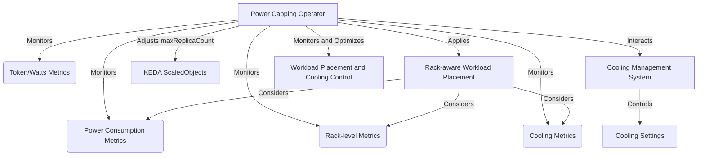

The flowchart above illustrates the rack-aware cooling optimization enhancement:

1. The power capping operator monitors the power consumption metrics, rack-level metrics, token/watts metrics, and
   cooling metrics.
2. It applies the rack-aware workload placement algorithms, considering power consumption, rack-level constraints, and
   cooling efficiency.
3. The operator adjusts the `maxReplicaCount` of the KEDA ScaledObjects based on the power usage, rack-level
   constraints, and cooling requirements.
4. It interacts with the cooling management system to dynamically control the cooling settings based on the rack-level
   metrics and workload distribution.
5. The power capping operator continuously monitors and optimizes the workload placement and cooling control to maintain
   optimal power and cooling efficiency.

By incorporating rack-aware cooling optimization, the power capping operator can effectively manage the power
consumption, optimize the cooling efficiency, and reduce the cooling costs of the LLM inference system. This enhancement
complements the other power optimization techniques, such as power efficiency aware routing, GPU frequency tuning, and
power usage smoothing, to provide a comprehensive solution for efficient, scalable, and sustainable LLM inference in a
Kubernetes environment.

### 10.5 Topology Affinity for Rack-level Workload Placement

In this enhancement, we leverage Kubernetes' topology affinity feature to manage rack-level workload placement. By using topology annotations, 
the power capping operator can dynamically place new replicas on racks that are projected to reduce cooling costs and improve overall efficiency.

#### 10.5.1 Topology Annotations

Kubernetes allows the use of topology annotations to define the rack-level affinity for pods. The power capping operator 
can dynamically update these annotations based on the projected cooling costs and other rack-level metrics.

The topology annotation format for rack affinity can be as follows:

```yaml
affinity:
  nodeAffinity:
    requiredDuringSchedulingIgnoredDuringExecution:
      nodeSelectorTerms:
      - matchExpressions:
        - key: rack
          operator: In
          values:
          - rack1
```

In this example, the annotation specifies that the pod should be placed on a node belonging to "rack1".

#### 10.5.2 Dynamic Rack Affinity Update

The power capping operator continuously monitors the rack-level metrics, including cooling costs, power consumption, and temperature. 
Based on these metrics and the projected impact of placing new replicas on different racks, the operator dynamically updates 
the topology annotations of the LLM inference deployment.

The dynamic rack affinity update process involves the following steps:

1. Retrieve the current rack-level metrics and cooling costs.
2. Analyze the projected impact of placing new replicas on different racks.
3. Identify the rack that is expected to provide the lowest cooling cost and improved efficiency.
4. Update the topology annotation of the LLM inference deployment to target the selected rack.

By dynamically updating the topology annotations, the power capping operator ensures that new replicas are placed on racks that are 
projected to reduce cooling costs and improve overall efficiency.

#### 10.5.3 Integration with KEDA and Power Capping Operator

The topology affinity enhancement integrates seamlessly with KEDA and the power capping operator. 
When KEDA scales up the LLM inference deployment based on the defined scaling rules, the power capping operator intercepts 
the scaling event and updates the topology annotations before the new replicas are created.

The integration flow can be summarized as follows:

1. KEDA detects the need to scale up the LLM inference deployment based on the defined scaling rules.
2. KEDA sends a scaling event to the power capping operator.
3. The power capping operator retrieves the current rack-level metrics and projected cooling costs.
4. The operator determines the optimal rack for placing the new replicas based on the projected cooling costs and efficiency.
5. The operator updates the topology annotations of the LLM inference deployment to target the selected rack.
6. KEDA proceeds with the scaling operation, and the new replicas are placed on the specified rack.

By integrating topology affinity with KEDA and the power capping operator, the LLM inference system can dynamically optimize the 
rack-level workload placement to reduce cooling costs and improve overall efficiency.

#### 10.5.4 Enhancement Flowchart

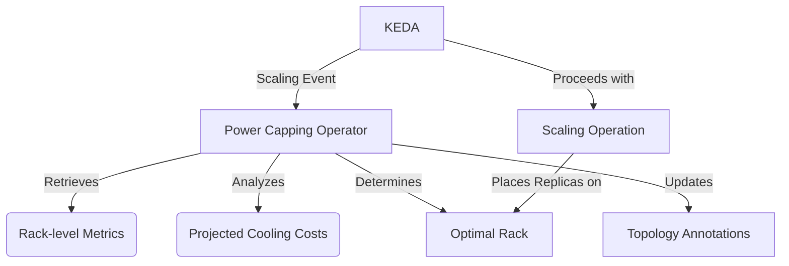

The flowchart above illustrates the topology affinity enhancement for rack-level workload placement:

1. KEDA detects the need for scaling and sends a scaling event to the power capping operator.
2. The power capping operator retrieves the current rack-level metrics and projected cooling costs.
3. It analyzes the projected cooling costs and determines the optimal rack for placing new replicas.
4. The operator updates the topology annotations of the LLM inference deployment to target the selected rack.
5. KEDA proceeds with the scaling operation, placing the new replicas on the specified rack.

By leveraging topology affinity and dynamically updating the rack affinity based on projected cooling costs, 
the power capping operator can optimize the rack-level workload placement. This enhancement complements the existing 
features of the power capping operator, such as power efficiency aware routing, GPU frequency tuning, power usage smoothing, 
and rack-aware cooling optimization, to provide a comprehensive solution for efficient and cost-effective LLM inference in a Kubernetes environment.

## 11. Conclusion

We present a comprehensive solution for a power-capped LLM inference service using Kubernetes. The
proposed system incorporates a custom power capping operator that manages the power consumption of LLM inference
deployments at both the server and rack levels. By leveraging KEDA for event-driven autoscaling, Kepler for power
monitoring, and rack-aware scheduling algorithms, the operator optimizes the workload placement and resource allocation
to minimize power consumption, reduce cooling requirements, and ensure compliance with power cap limits and rack-level
constraints.

The integration of the power capping operator with KServe and vLLM frameworks demonstrates its compatibility with
existing LLM inference platforms and its ability to seamlessly manage power capping configurations across multiple
deployments. The operator also incorporates real-time carbon intensity data to dynamically adjust the power cap and
achieve target carbon emission goals.

Furthermore, the enhancements discussed, such as power efficiency aware routing, GPU frequency tuning, power usage
smoothing, and rack-aware cooling optimization, showcase the potential for further optimizing the power efficiency,
performance, and sustainability of the LLM inference system. By leveraging advanced techniques and insights from
industry research, the power capping operator can intelligently manage workload placement, resource allocation, and
cooling control to maximize the overall efficiency of the system.

The proposed solution addresses the critical challenges of power management, cooling optimization, and carbon footprint
reduction in large-scale data centers running LLM inference workloads. By providing a holistic approach that considers
server-level, rack-level, and data center-level optimizations, the power capping operator enables the deployment of
scalable, power-efficient, and environmentally sustainable LLM inference services in Kubernetes environments.

Future work can explore the integration of the power capping operator with other LLM inference frameworks, the
incorporation of advanced AI techniques for workload prediction and proactive power management, and the extension of the
operator to support multi-datacenter and edge computing scenarios. Additionally, the development of user-friendly
interfaces and automated configuration tools can simplify the deployment and management of power-capped LLM inference
services for data center operators and ML practitioners.

In conclusion, the power-capped LLM inference service using Kubernetes, powered by the custom power capping operator,
represents a significant step towards achieving power efficiency, cooling optimization, and carbon footprint reduction
in large-scale LLM inference deployments. By embracing innovative techniques and best practices, this solution paves the
way for the sustainable and efficient adoption of LLM technologies in various domains and applications.