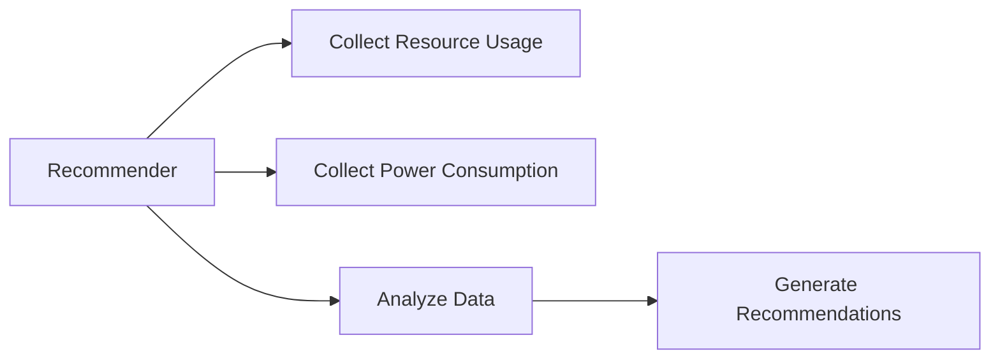
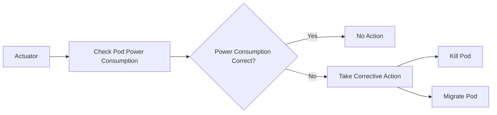
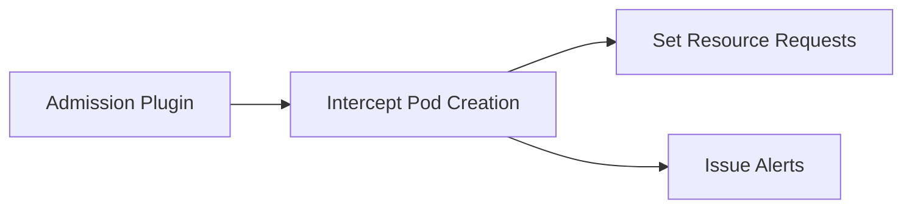
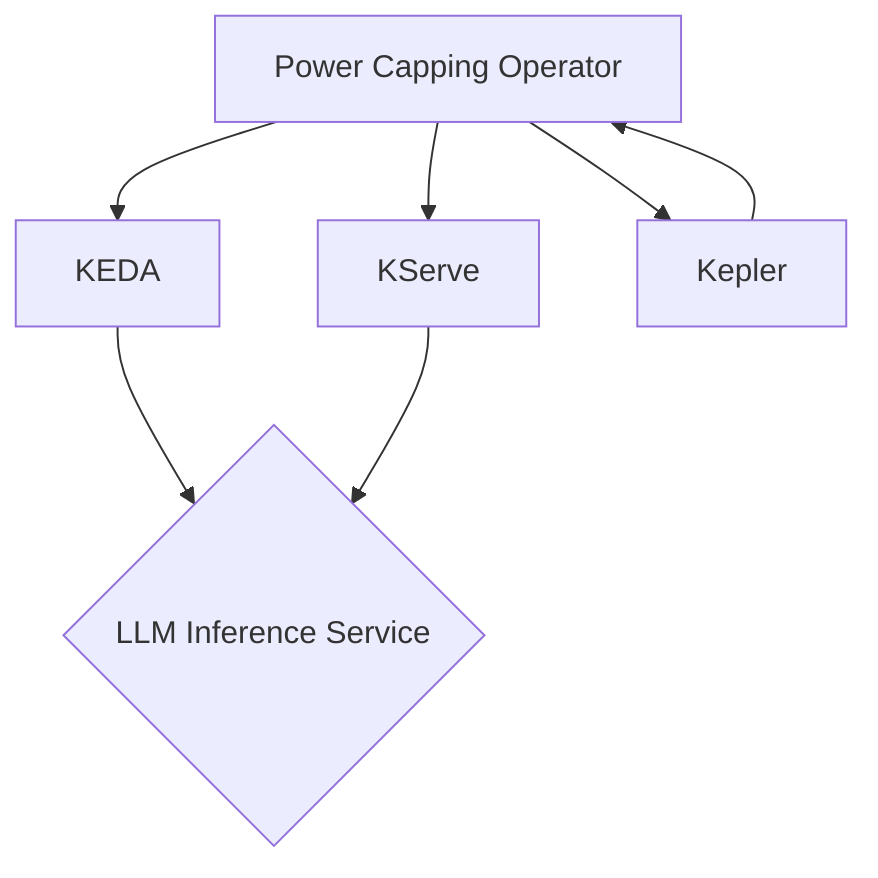
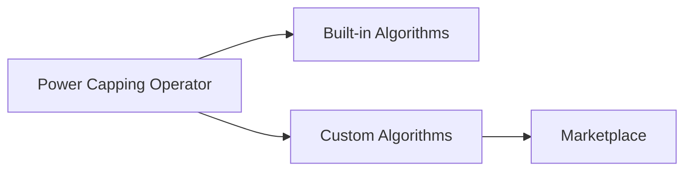

# Power Capping Operator Architecture

The power capping operator follows an architecture similar to the Kubernetes Vertical Pod Autoscaler (VPA) controller.
It consists of three main components: Recommender, Actuator, and Admission Plugin.

## Components

### 1. Recommender

The Recommender component is responsible for monitoring the current and past resource and power consumption of the
managed pods. It analyzes the collected data and provides recommended actions for the Actuator based on the defined
policies and constraints.

The Recommender performs the following tasks:

- Collects resource usage data from the Kubernetes API server
- Collects power consumption data from Kepler or other power monitoring tools
- Analyzes the collected data to identify pods that violate the power capping policies
- Generates recommendations for the Actuator, such as killing or migrating pods

### 2. Actuator

The Actuator component checks which of the managed pods have correct power consumption set and, if not, takes
appropriate actions to conform to the power capping and performance-power ratio policies.

The Actuator performs the following tasks:

- Receives recommendations from the Recommender
- Checks the power consumption of the managed pods
- Takes corrective actions if the power consumption violates the defined policies
    - Kills pods that exceed the power cap limit
    - Migrates pods to nodes with available power budget

### 3. Admission Plugin

The Admission Plugin component is responsible for setting the correct resource requests on new pods and issuing alerts
for passive actuators.

The Admission Plugin performs the following tasks:

- Intercepts pod creation requests
- Sets the correct resource requests on new pods based on the defined policies
- Issues alerts for passive actuators, such as sending notifications to monitoring systems

## Integration with Kubernetes Tools

The power capping operator integrates with existing Kubernetes tools and frameworks to leverage their functionality and
provide a comprehensive solution for power capping and workload optimization.

The integrations include:

- KEDA (Kubernetes Event-Driven Autoscaling): The power capping operator uses KEDA to scale the LLM inference service
  deployment based on the specified power cap and workload requirements.
- KServe: The operator integrates with KServe to manage the serving of LLM inference workloads and optimize their
  placement and scaling.
- Kepler: Kepler is used as a power monitoring tool to collect power consumption data from the CPU and GPU resources on
  the server. The operator uses this data to make informed decisions about workload placement and power capping.

By integrating with these tools, the power capping operator can effectively manage the power consumption and workload
placement of LLM inference services in a Kubernetes environment.

## Custom Algorithms and Marketplace

The power capping operator provides a flexible architecture that allows data centers to develop or purchase custom
algorithms from a marketplace to cover specific needs and use cases. These custom algorithms can be plugged into the
operator to extend its functionality and optimize power capping and workload placement based on different criteria.

The custom algorithms can be developed by the data center team or obtained from the marketplace, which serves as a
platform for sharing and selling algorithms contributed by the community. This enables data centers to leverage the
expertise and innovations of the broader community to address their specific power capping and workload optimization
requirements.

By supporting custom algorithms and integrating with a marketplace, the power capping operator provides a flexible and
extensible solution that can adapt to the evolving needs of data centers and the LLM inference workloads they manage.