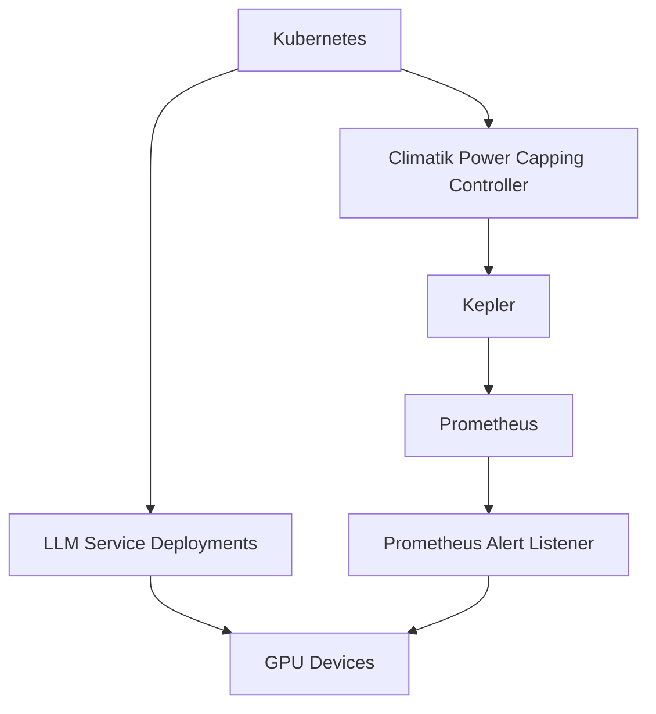
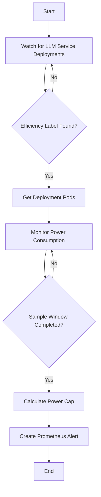

# GPU Power Capping Controller Design Spec

---

## Overview

- Climatik controller to power cap GPUs used by LLM inference service deployments
- Each service deployment uses GPUs for inference
- Services use LLM models with different parameter sizes (e.g., 7B, 13B, 70B) or different service SLA objectives
- Labels define the efficiency level of the LLM service
- Climatik controller monitors power consumption using Kepler and creates power capping intructions for Prometheus alerts
- Prometheus alerts are created with GPU device ID, node, and power capping level
- Prometheus alert listener takes actions to power cap the GPUs

---

## Architecture



---

## Controller Workflow



---

## Efficiency Labels

- Administrators assign labels to LLM service deployments based on SLAs
- Labels define the efficiency level of the LLM service
- Example labels:
  - `efficiency: low`
  - `efficiency: medium`
  - `efficiency: high`

---

## Power Consumption Monitoring

- Controller uses Kepler to monitor power consumption of pods within the deployments
- Monitoring duration is defined by the sample window in the API
- Peak power consumption is determined during the sample window

---

## Power Capping Calculation

- Controller uses absolute power consumption or a relative power cap based on peak or average consumption
- Power capping calculation based on the `PowerCappingSpec` in the API
- Absolute power cap:
  - `AbsolutePowerCapInWattsSpec`
- Relative power cap:
  - `RelativePowerCapOfPeakPowerConsumptionInPercentage`
  - `RelativePowerCappingOfAveragePowerConsumptionInPercentage`

---

## Prometheus Alert

- Controller creates a Prometheus alert with power capping information
- Alert includes:
  - GPU device ID
  - Node
  - Power capping level
- Prometheus alert listener takes actions to power cap the GPUs used by the pods

---

## High-Level Logic

```go
func (c *Controller) syncDeployment(deployment *appsv1.Deployment) error {
    efficiencyLabel := deployment.Labels["efficiency"]
    if efficiencyLabel == "" {
        return nil
    }

    pods, err := c.getDeploymentPods(deployment)
    if err != nil {
        return err
    }

    powerConsumption, err := c.monitorPowerConsumption(pods)
    if err != nil {
        return err
    }

    powerCap := c.calculatePowerCap(powerConsumption)

    alert := c.createPrometheusAlert(powerCap)
    if err := c.sendPrometheusAlert(alert); err != nil {
        return err
    }

    return nil
}
```

---

## Prometheus Alert Listener

- Listens for Prometheus alerts generated by the controller
- Takes actions to power cap the GPUs based on the alert information
- Actions may include:
  - Updating GPU power limit using NVIDIA Management Library (NVML or `nvidia-smi`)
  - Updating GPU SM clock frequency
  - Updating GPU memory clock frequency
---

## Summary

- Climatik controller monitors LLM service deployments
- Efficiency labels define the efficiency level of the LLM service
- Climatik controller monitors power consumption using Kepler
- Power capping calculation based on the API spec
- Prometheus alerts are created with power capping information
- Prometheus alert listener takes actions to power cap the GPUs

---

## Future Enhancements

- Dynamic adjustment of power caps based on workload characteristics
- Automated efficiency labeling based on SLA metrics
- Support for multi-GPU deployments
- Support for different GPU models
- Support for autoscalable deployments
---
