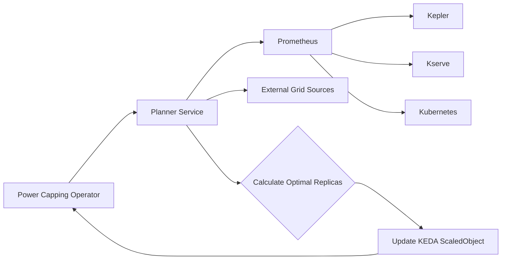

# Design Spec: Power Capping Operator with Planner Service

## 1. Overview

The Power Capping Operator is a Kubernetes operator that manages the power consumption of LLM inference deployments. It integrates with KEDA to autoscale each LLM inference deployment based on the power capping constraint.

The operator communicates with a gRPC service called Planner. The Planner service is responsible for calculating the optimal number of replicas for each LLM inference deployment while considering the power consumption, load metrics, electricity pricing, and carbon intensity.

The Planner service fetches metrics from various sources, including Prometheus, Kepler, Kserve, Kubernetes, and external electricity grid sources. It uses time series-based ML algorithms to predict the power consumption of LLM inference services under different load conditions and determines the optimal performance/watt configurations based on the power capping constraint.

## 2. Architecture

- Power Capping Operator: A Kubernetes operator written in Golang that manages the power capping of LLM inference deployments.
- Planner Service: A gRPC service written in Python that calculates the optimal number of replicas for each LLM inference deployment based on power consumption, load metrics, electricity pricing, and carbon intensity.
- Prometheus: A monitoring system that collects metrics from various sources, including Kepler, Kserve, and Kubernetes.
- Kepler: A Prometheus exporter that provides power consumption metrics for Kubernetes Pods.
- Kserve: A serverless model serving framework.
- External Grid Sources: External APIs or data sources that provide electricity pricing and carbon intensity information.

The following diagram illustrates the architecture of the Power Capping Operator with the Planner Service:


1. The Power Capping Operator sends a request to the Planner Service to calculate the optimal number of replicas for each LLM inference deployment.
2. The Planner Service fetches metrics from Prometheus, which collects data from Kepler (power consumption metrics), Kserve (load metrics), and Kubernetes (deployment metrics).
3. The Planner Service also retrieves electricity pricing and carbon intensity information from external grid sources.
4. The Planner Service uses time series-based ML algorithms to predict the power consumption of LLM inference services under different load conditions and calculates the optimal number of replicas based on the power capping constraint.
5. The Planner Service returns the calculated optimal number of replicas to the Power Capping Operator.
6. The Power Capping Operator updates the KEDA ScaledObject with the maximum replica count for each LLM inference deployment.

## 3. gRPC Function Prototype

The Planner Service exposes a gRPC function that the Power Capping Operator can call to calculate the optimal number of replicas for each LLM inference deployment. Here's the function prototype:

```proto
service Planner {
  rpc CalculateOptimalReplicas(CalculateOptimalReplicasRequest) returns (CalculateOptimalReplicasResponse) {}
}

message CalculateOptimalReplicasRequest {
  repeated Deployment deployments = 1;
  double powerCap = 2;
}

message Deployment {
  string name = 1;
  string namespace = 2;
}

message CalculateOptimalReplicasResponse {
  repeated DeploymentReplicas deploymentReplicas = 1;
}

message DeploymentReplicas {
  string name = 1;
  string namespace = 2;
  int32 optimalReplicas = 3;
}
```

- `CalculateOptimalReplicas`: The gRPC function that the Power Capping Operator calls to calculate the optimal number of replicas for each LLM inference deployment.
- `CalculateOptimalReplicasRequest`: The request message that contains the list of deployments and the power cap value.
- `Deployment`: A message representing a deployment, including its name and namespace.
- `CalculateOptimalReplicasResponse`: The response message that contains the calculated optimal number of replicas for each deployment.
- `DeploymentReplicas`: A message representing the optimal number of replicas for a specific deployment.

## 4. Implementation Details

### 4.1 Power Capping Operator

The Power Capping Operator is implemented in Golang using the Operator SDK framework. It performs the following tasks:

1. Watches for changes in the LLM inference deployments and their associated KEDA ScaledObjects.
2. Periodically calls the Planner Service to calculate the optimal number of replicas for each deployment.
3. Updates the KEDA ScaledObject with the calculated maximum replica count.
4. Monitors the power consumption metrics and adjusts the maximum replica count based on the power capping constraint.

### 4.2 Planner Service

The Planner Service is implemented in Python and exposes a gRPC endpoint for the Power Capping Operator to call. It performs the following tasks:

1. Fetches power consumption metrics from Kepler via Prometheus.
2. Retrieves load metrics from Kserve via Prometheus.
3. Obtains deployment metrics from Kubernetes via Prometheus.
4. Fetches electricity pricing and carbon intensity information from external grid sources.
5. Uses time series-based ML algorithms to predict the power consumption of LLM inference services under different load conditions.
6. Calculates the optimal number of replicas for each deployment based on the power capping constraint and the predicted power consumption.
7. Returns the calculated optimal number of replicas to the Power Capping Operator.

### 4.3 Prometheus Integration

The Planner Service queries Prometheus to fetch the necessary metrics for its calculations, including (but not limited to) power consumption metrics from Kepler, load metrics from Kserve, and deployment metrics from Kubernetes. Prometheus provides a read-only and centralized monitoring system that collects and stores these metrics, making them easily accessible to the Planner Service.

### 4.4 External Grid Sources Integration

The Planner Service integrates with external APIs or data sources to retrieve electricity pricing and carbon intensity information. This information is used to optimize the performance/watt configurations based on cost and environmental factors.

## 5. Conclusion

The Power Capping Operator, in conjunction with the Planner Service, enables intelligent power capping of LLM inference deployments in a Kubernetes environment. By leveraging metrics from Prometheus, Kepler, Kserve, and external grid sources, the Planner Service predicts the power consumption of LLM inference services and calculates the optimal number of replicas based on the power capping constraint.

The Power Capping Operator updates the KEDA ScaledObject with the calculated maximum replica count, ensuring that the LLM inference deployments operate within the specified power limits while optimizing performance and considering cost and carbon intensity factors.

This design allows for dynamic and adaptive power capping of LLM inference deployments, enabling efficient resource utilization and reducing overall power consumption in the Kubernetes cluster.s