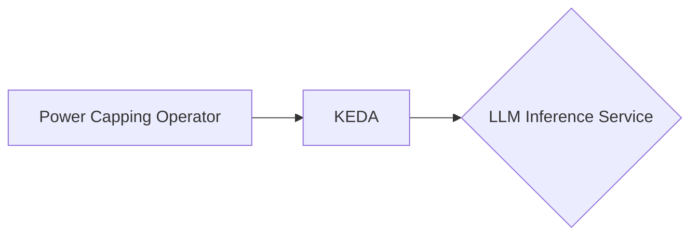
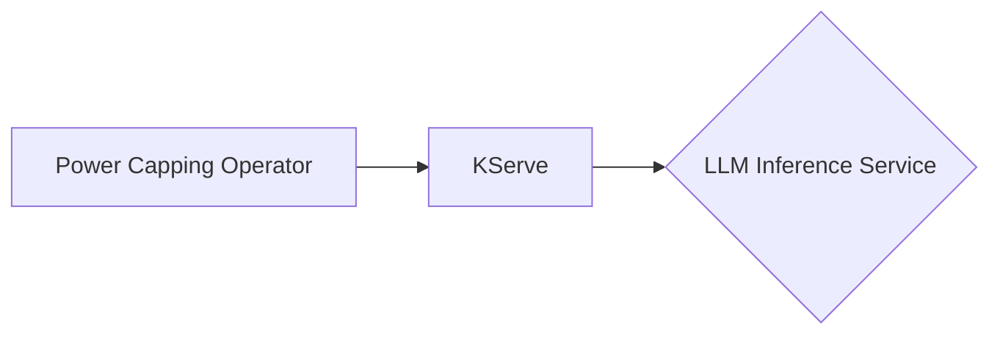
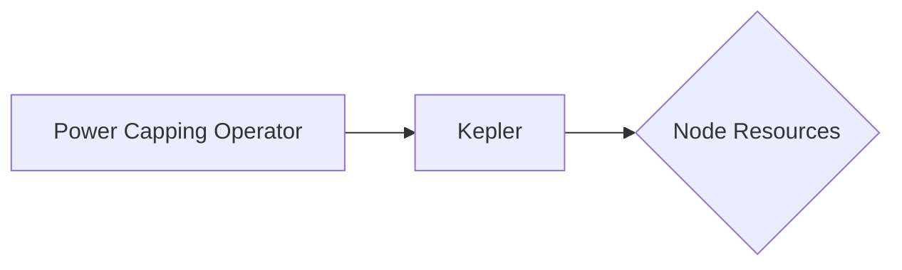
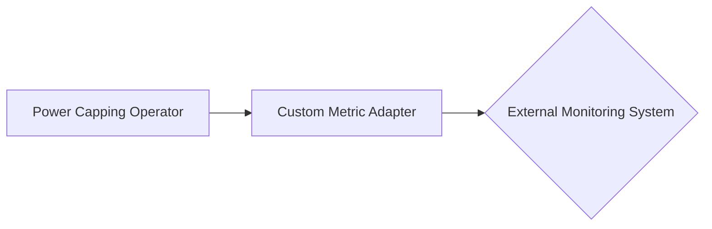
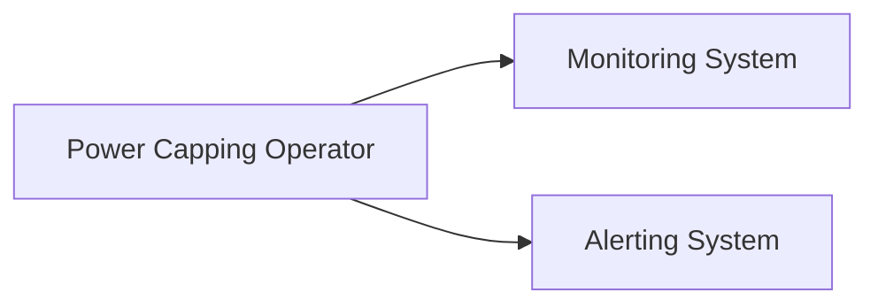

# Integrations with Kubernetes Tools

The power capping operator seamlessly integrates with existing Kubernetes tools and frameworks to provide a
comprehensive solution for power capping and workload optimization in LLM inference services. This document highlights
the key integrations and how they enhance the functionality of the power capping operator.

## KEDA (Kubernetes Event-Driven Autoscaling)

The power capping operator integrates with [KEDA](https://keda.sh/) to enable event-driven autoscaling of LLM inference
service deployments based on the specified power cap and workload requirements.

Integration with KEDA provides the following benefits:

- Automatically scales the LLM inference service deployment based on the power consumption and workload demands
- Ensures that the power cap limit is not exceeded while maintaining the desired performance levels
- Optimizes resource utilization by scaling the deployment up or down based on the specified policies

To enable KEDA integration, create a `ScaledObject` resource that defines the scaling rules and targets for the LLM
inference service deployment. The power capping operator will automatically configure KEDA based on the power capping
policies defined in the CRD.

## KServe

The power capping operator integrates with [KServe](https://kserve.github.io/website/), a Kubernetes-native platform for
serving machine learning models, to manage the serving of LLM inference workloads and optimize their placement and
scaling.

Integration with KServe provides the following benefits:

- Seamlessly manages the deployment and scaling of LLM inference services using KServe's serving capabilities
- Optimizes workload placement and resource allocation based on the power capping policies and rack-level constraints
- Leverages KServe's built-in features such as model versioning, canary deployments, and traffic splitting

To enable KServe integration, create an `InferenceService` resource that defines the LLM model and serving
configuration. The power capping operator will work in conjunction with KServe to manage the power consumption and
workload placement of the inference service.

## Kepler

The power capping operator integrates with [Kepler](https://sustainable-computing-io.github.io/kepler/), a power
monitoring tool for Kubernetes, to collect power consumption data from the CPU and GPU resources on the servers.

Integration with Kepler provides the following benefits:

- Accurate and real-time power consumption data for CPU and GPU resources
- Visibility into the power usage patterns of LLM inference workloads
- Enables the power capping operator to make informed decisions about workload placement and power capping based on the
  collected data

To enable Kepler integration, deploy Kepler on your Kubernetes cluster and configure it to monitor the desired node
resources. The power capping operator will automatically discover and use the power consumption data provided by Kepler.

## Custom Metric Adapters

The power capping operator can integrate with custom metric adapters to collect power consumption data from various
sources and use them for power capping and workload optimization.

Integration with custom metric adapters provides the following benefits:

- Flexibility to collect power consumption data from external monitoring systems or custom data sources
- Enables the power capping operator to work with existing monitoring infrastructure and tools
- Allows for the use of specialized power monitoring devices or APIs

To integrate with a custom metric adapter, implement the required interface and configure the power capping operator to
use the adapter for collecting power consumption data. The adapter should retrieve the power consumption metrics from
the desired source and provide them to the power capping operator in a compatible format.

## Monitoring and Alerting

The power capping operator integrates with monitoring and alerting systems to provide visibility into the power
consumption and workload performance of LLM inference services.

Integration with monitoring and alerting systems provides the following benefits:

- Real-time monitoring of power consumption and workload performance metrics
- Alerting capabilities to notify operators when power cap limits are exceeded or performance degradation occurs
- Dashboards and visualizations to gain insights into the power usage and workload behavior

To enable monitoring and alerting integration, configure the power capping operator to export relevant metrics to the
desired monitoring system (e.g., Prometheus) and set up alerting rules based on the defined thresholds and policies. The
monitoring system can then be used to visualize the metrics and trigger alerts when necessary.

These integrations enhance the power capping operator's functionality and provide a comprehensive solution for managing
power consumption and workload optimization in LLM inference services running on Kubernetes.