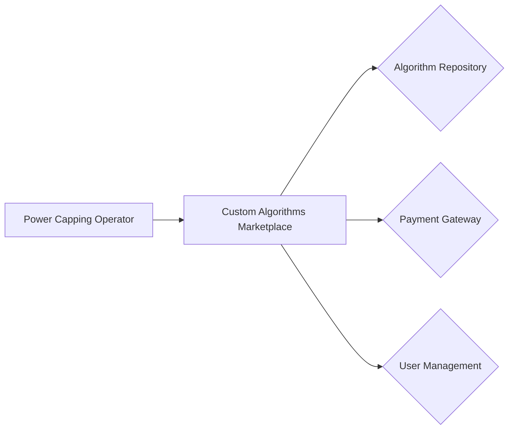
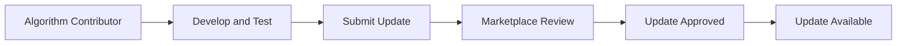
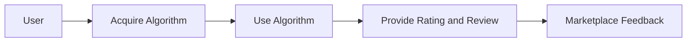
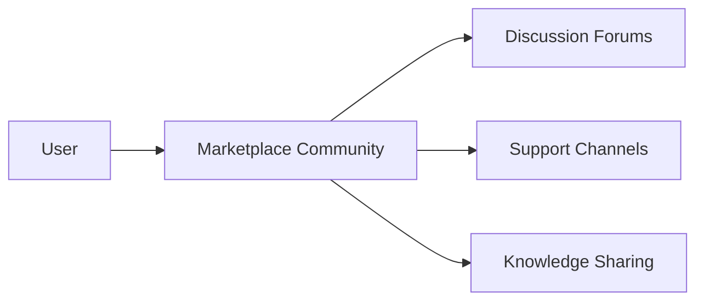

# Custom Algorithms Marketplace

The power capping operator provides a flexible and extensible architecture that allows data centers to leverage custom
algorithms for power capping and workload optimization. To facilitate the sharing and distribution of these custom
algorithms, the power capping operator integrates with a marketplace.

## Overview

The custom algorithms marketplace serves as a platform for data centers, developers, and the community to contribute,
share, and sell algorithms that extend the functionality of the power capping operator. The marketplace enables users to
discover, acquire, and deploy custom algorithms tailored to their specific needs and use cases.

Key components of the custom algorithms marketplace include:

- Algorithm Repository: A centralized repository that hosts the custom algorithms contributed by the community.
- Payment Gateway: A secure payment system for purchasing commercial algorithms from the marketplace.
- User Management: A user management system for authentication, authorization, and access control to the marketplace.

## Contributing Custom Algorithms

Data centers and developers can contribute their custom algorithms to the marketplace by following these steps:

1. Develop the custom algorithm according to the guidelines and specifications provided by the power capping operator.
2. Test and validate the algorithm to ensure its compatibility and performance.
3. Package the algorithm in a standardized format, including any necessary dependencies and documentation.
4. Submit the algorithm to the marketplace repository through the provided contribution process.
5. Provide metadata and description for the algorithm, including its purpose, input parameters, and expected outputs.
6. Specify the licensing terms and pricing model for the algorithm (open-source, commercial, subscription-based, etc.).
7. Wait for the algorithm to be reviewed and approved by the marketplace maintainers.
8. Once approved, the algorithm will be available for users to discover and acquire from the marketplace.

## Acquiring Custom Algorithms

Data centers and users can acquire custom algorithms from the marketplace using the following steps:

1. Browse the marketplace repository to discover available custom algorithms.
2. Review the algorithm descriptions, metadata, and pricing information to find suitable algorithms for their needs.
3. Purchase commercial algorithms through the integrated payment gateway, or download open-source algorithms directly.
4. Receive the algorithm package, including the necessary files and documentation.
5. Deploy the custom algorithm in their power capping operator environment by following the provided installation
   instructions.
6. Configure the power capping operator to use the custom algorithm by specifying the algorithm name and any required
   parameters in the PowerCappingPolicy CRD.

## Algorithm Maintenance and Updates

Contributors of custom algorithms are responsible for maintaining and updating their algorithms to ensure compatibility
with the latest versions of the power capping operator and address any bugs or performance issues.

The marketplace provides mechanisms for algorithm contributors to submit updates and new versions of their algorithms.
Users who have acquired the algorithms will be notified of available updates and can choose to upgrade to the latest
versions.

## Algorithm Ratings and Reviews

The marketplace incorporates a rating and review system to help users make informed decisions when acquiring custom
algorithms. Users can provide feedback, ratings, and reviews for the algorithms they have used, sharing their
experiences and recommendations with the community.

Algorithm contributors can benefit from the feedback and reviews to improve their algorithms and address any reported
issues or suggestions.

## Support and Community Engagement

The custom algorithms marketplace fosters a community of developers, data centers, and users who collaborate, share
knowledge, and provide support for the power capping operator and its ecosystem.

The marketplace provides forums, discussion boards, and communication channels for users to engage with algorithm
contributors, seek assistance, and share their experiences and best practices.

Through active community engagement, the marketplace aims to create a vibrant ecosystem that drives innovation,
collaboration, and continuous improvement in the field of power capping and workload optimization.

By leveraging the custom algorithms marketplace, data centers can access a wide range of algorithms developed by the
community, tailored to their specific requirements. The marketplace enables them to extend the capabilities of the power
capping operator and optimize their power consumption and workload performance in a flexible and customizable manner.