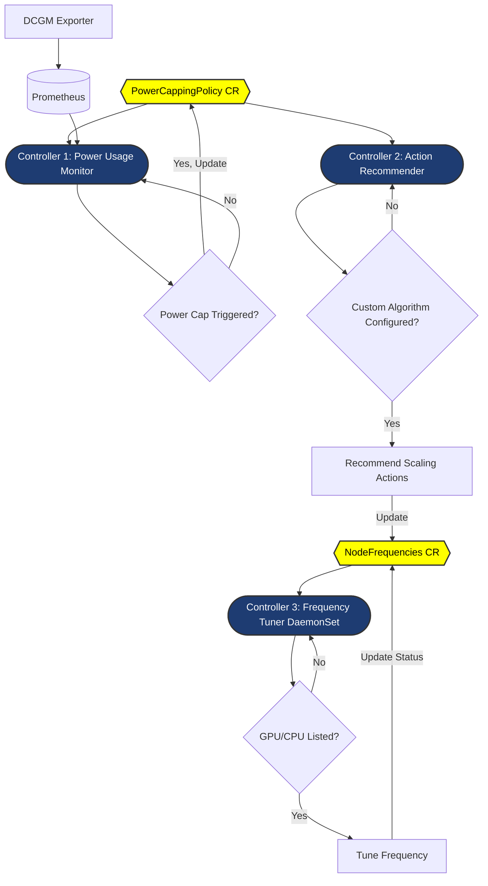

# Power Capping System Design Document

## System Overview

This system is designed to dynamically tune GPU and CPU frequencies to implement power capping for specific services or workloads in a Kubernetes environment. It uses Custom Resources (CRs) and controllers to monitor power usage, recommend actions, and apply frequency changes.

## System Architecture Diagram



## Custom Resources (CRs)

### 1. PowerCappingPolicy CR (Box A in yellow)

- **Purpose**: Defines the power capping policy for a specific workload or service.
- **Example CR**:
  ```yaml
  apiVersion: powercapping.example.com/v1alpha1
  kind: PowerCappingPolicy
  metadata:
    name: llm-inference-power-cap
    namespace: ai-services
  spec:
    powerCapLimit: 1000  # Power cap limit in watts
    selector:
      matchLabels:
        app: llm-inference
        tier: gpu
    cappingThreshold: 90  # Trigger capping when 90% of the limit is reached
    customAlgorithms:
      - name: dynamic-frequency-scaler
        parameters:
          scaling-factor: "0.8"
          min-frequency: "300"
  status:
    cappingActionRequired: false
    lastUpdated: "2024-10-10T12:00:00Z"
  ```
- **Key Fields**:
  - powerCapLimit: The maximum power consumption allowed for the selected workload, in watts.
  - selector: Kubernetes label selector to identify the pods/workloads this policy applies to.
  - cappingThreshold: The percentage of the power cap at which capping actions should be triggered.
  - customAlgorithms: Defines custom algorithms for determining frequency adjustments, including algorithm-specific parameters.
    - status.cappingActionRequired: Indicates whether a capping action is currently needed.
    - status.lastUpdated: Timestamp of the last status update.

### 2. NodeFrequencies CR (Box J in yellow)

- **Purpose**: Manages the frequency settings for GPUs and CPUs on specific nodes.
- **Example CR**:
  ```yaml
  apiVersion: compute.example.com/v1alpha1
  kind: NodeFrequencies
  metadata:
    name: gpu-node-01-frequencies
  spec:
    nodeName: gpu-node-01
    gpuFrequencies:
      - gpuId: "GPU-1a2b3c4d"
        targetFrequency: 1200
      - gpuId: "GPU-5e6f7g8h"
        targetFrequency: 1100
    cpuFrequencies:
      - cpuId: 0
        targetFrequency: 2400
      - cpuId: 1
        targetFrequency: 2200
  status:
    gpuFrequencies:
      - gpuId: "GPU-1a2b3c4d"
        currentFrequency: 1200
        targetFrequency: 1200
        status: "Applied"
      - gpuId: "GPU-5e6f7g8h"
        currentFrequency: 1150
        targetFrequency: 1100
        status: "Pending"
    cpuFrequencies:
      - cpuId: 0
        currentFrequency: 2400
        targetFrequency: 2400
        status: "Applied"
      - cpuId: 1
        currentFrequency: 2300
        targetFrequency: 2200
        status: "Pending"
    lastUpdated: "2024-10-10T12:05:00Z"
  ```
- **Key Fields**:
  - spec.nodeName: The name of the node these frequency settings apply to.
  - spec.gpuFrequencies: List of target frequencies for each GPU on the node.
  - spec.cpuFrequencies: List of target frequencies for each CPU core on the node.
  - status.gpuFrequencies: Current status of GPU frequency changes, including current and target frequencies.
  - status.cpuFrequencies: Current status of CPU frequency changes, including current and target frequencies.
  - status.lastUpdated: Timestamp of the last status update.
    
## Controllers

### 1. Power Usage Monitor (Controller 1, Box B in dark blue)

- **Purpose**: Monitors power usage and determines if capping is needed.
- **Interactions**:
  - Reads from PowerCappingPolicy CR (Box A)
  - Updates PowerCappingPolicy CR status (Box A)
  - Receives data from Prometheus (Box Q, fed by DCGM Exporter, Box P)

### 2. Action Recommender (Controller 2, Box E in dark blue)

- **Purpose**: Recommends scaling actions based on the power capping policy.
- **Interactions**:
  - Reads from PowerCappingPolicy CR (Box A)
  - Creates/Updates NodeFrequencies CR (Box J) with recommended actions

### 3. Frequency Tuner DaemonSet (Controller 3, Box K in dark blue)

- **Purpose**: Applies frequency changes on individual nodes.
- **Interactions**:
  - Reads from NodeFrequencies CR (Box J)
  - Updates NodeFrequencies CR status after applying changes (Box J)

## System Workflow

1. **Policy Definition**: 
   - A PowerCappingPolicy CR (Box A) is created to define the power cap for a specific workload.

2. **Power Monitoring**:
   - Controller 1 (Box B) continuously monitors power usage using data from DCGM Exporter (Box P) via Prometheus (Box Q).
   - If power usage approaches the cap (Box C), Controller 1 updates the PowerCappingPolicy CR status (Box A).

3. **Action Recommendation**:
   - Controller 2 (Box E) reads the PowerCappingPolicy CR (Box A) and checks for custom algorithms (Box G).
   - If configured, it recommends scaling actions (Box H) and creates/updates the NodeFrequencies CR (Box J).

4. **Frequency Tuning**:
   - Controller 3 (Box K, running as a DaemonSet on each node) reads the NodeFrequencies CR (Box J).
   - If changes are needed for its node (Box M), it applies the frequency adjustments to GPUs/CPUs (Box N).
   - After applying changes, it updates the status in the NodeFrequencies CR (Box J).

5. **Continuous Monitoring and Adjustment**:
   - The process continues in a loop, with Controller 1 (Box B) monitoring power usage and triggering new recommendations and adjustments as needed.

## Key Benefits

1. **Dynamic Power Management**: Allows for real-time adjustment of power usage based on defined policies.
2. **Workload-Specific Policies**: Enables setting different power caps for different services or workloads.
3. **Flexible Algorithm Integration**: Supports custom algorithms for determining frequency adjustments.
4. **Kubernetes-Native Design**: Utilizes CRs and controllers for seamless integration with Kubernetes environments.

This design provides a scalable and flexible approach to power management in Kubernetes clusters, particularly useful for GPU-intensive workloads like LLM inference and training.
